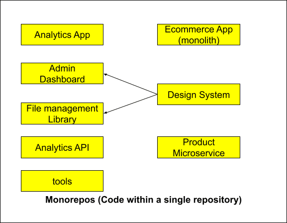
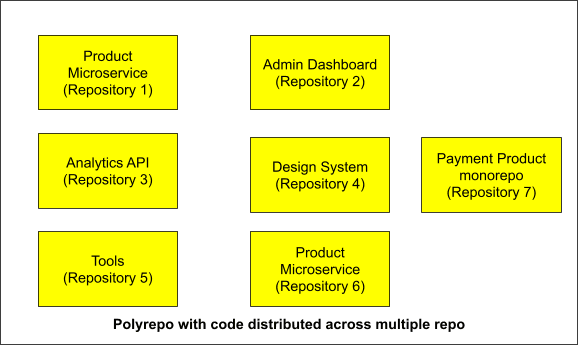

When several teams depend on the same design system, business logic, or API surface, keeping those pieces in sync across separate repositories becomes expensive. A monorepo puts that shared code in one place, so a fix lands once and a breaking change is caught earlier.

But once every team commits to the same tree, a bad change becomes everyone's problem. That is the tradeoff.

## Monorepo, polyrepo, and monolith

A monorepo puts every project in one repository. Teams can still use different stacks and ship independently, but the code lives in a shared history.

A polyrepo splits that work across repositories. That makes sense when teams are truly independent, own unrelated products, or need strict boundaries for compliance or open-source distribution.

A monolith is different. It describes how software is deployed and tested, not where the code is stored. You can run a monolith inside a monorepo or split one across many repositories.

## When a monorepo is the right call

A monorepo is usually worth it when teams actually share code.

- shared design systems
- shared business rules
- shared APIs or SDKs
- large refactors that touch many apps
- atomic changes with coordinated rollout

In a polyrepo, a change that should be global becomes a series of separate pull requests, package releases, and dependency upgrades. A shared API change can require coordination across multiple teams and repositories, and a rollback can become a distributed incident.

A monorepo makes that coordination simpler. The same change lands as one commit, one review, and one history. Reverting it is easier, too.

That is why monorepos often become the default when a product grows from a handful of independent projects into a network of dependent apps.

## Why build tooling changed the equation

For years, one of the strongest objections to monorepos was build time. A change in one shared package could trigger rebuilds across many projects.

Modern tooling changed that. Caching and task orchestration let build pipelines skip anything that did not change. With the right setup, a monorepo can rebuild only the projects affected by a given change.

That makes the decision less about raw performance and more about whether the organization benefits from shared code and unified change management.

## When polyrepo is the better choice

Polyrepo is not wrong. It is just a better fit for a different problem.

It is a good choice when teams own unrelated products, ship on different schedules, or have no meaningful code sharing. It also works well when compliance, access control, or open-source contribution boundaries require separating repositories.

In those cases, a monorepo adds coordination cost without obvious gain.

## The hidden cost of a monorepo

The real cost of a monorepo is not build speed. It is review quality and change blast radius.

When many teams share the same tree, one careless change can reach everyone downstream. That means review needs to be faster, clearer, and more systematic.

That is especially true as more code in pull requests is generated by agents rather than written by the team that owns the change. A reviewer may understand the broader system but still need help understanding the exact behavior of a specific diff.

## The practical takeaway

Choose a monorepo when shared code is a first-class part of the product strategy. Choose a polyrepo when independence is the priority.

The best architecture is the one that matches how teams actually work and how code actually flows. If your organization depends on a shared design system, shared business logic, or coordinated releases, a monorepo can be the more productive choice. If it does not, separate repositories may be the better long-term fit.
