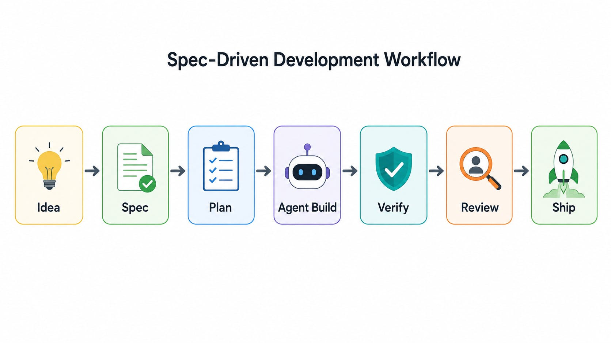

AI agents can generate code quickly. Specs, skills, and workflows decide whether they generate software a team can safely ship.

AI coding agents have changed the economics of implementation. Creating a function, test, migration, or UI component is becoming cheaper and faster.

But ambiguity is not.

A vague request still produces vague architecture. An incomplete acceptance criterion still creates rework. A missing security constraint still becomes a production defect. AI has not removed the need for engineering judgment; it has made that judgment the bottleneck.

That is why **spec-driven development** is becoming a core skill for developers and individual contributors building with AI agents.

## What Is Spec-Driven Development?

Spec-driven development puts a clear, testable specification at the center of delivery.

Instead of starting with “build a dashboard for storage health,” a developer defines:

- the user outcome
- in-scope and out-of-scope behavior
- functional and non-functional requirements
- interfaces and data contracts
- security, reliability, and performance constraints
- acceptance criteria and edge cases

The agent then uses that specification to produce a design, implementation plan, code, tests, and documentation.

The spec is not a heavyweight requirements document. It is the shared contract that prevents a capable agent from confidently building the wrong thing.

## The New Agentic Delivery Stack

A good specification alone is not enough. Agents also need reusable ways of working.

| Artifact     | What it defines                                     | Why the agent needs it                          |
| :----------- | :-------------------------------------------------- | :---------------------------------------------- |
| **Spec**     | Intent, constraints, and acceptance criteria        | Keeps implementation aligned to the actual goal |
| **Skill**    | A reusable procedure, checklist, and tool boundary  | Makes recurring work consistent                 |
| **Workflow** | The required sequence of steps and approval gates   | Prevents skipped validation                     |
| **Proof**    | Tests, traces, review evidence, and rollout results | Shows that the change works                     |

Think of these as the operating system around the model.

A **spec** says: “Add tenant-scoped storage retention settings with audit logging.”

A **skill** says: “For a database migration, inspect the schema, create a backward-compatible migration, run migration tests, and produce a rollback plan.”

A **workflow** says: “Do not modify code until the spec and design are approved; do not merge until tests, security checks, and review evidence are attached.”

The agent can write code. These artifacts tell it how to work responsibly.

## The Spec–Skill–Workflow–Proof Loop

A practical pattern is the **Spec–Skill–Workflow–Proof loop**:

1. **Specify** — Write the outcome, constraints, non-goals, and acceptance tests.
2. **Specialize** — Give the agent the relevant skill: API change, database migration, security review, incident runbook, or deployment.
3. **Sequence** — Define the workflow: analyze, plan, implement, test, review, and release.
4. **Prove** — Require test output, change summaries, observability checks, and rollback readiness.

This approach changes the developer’s role. Instead of repeatedly correcting an agent after it makes assumptions, the developer front-loads the assumptions into an artifact the agent can follow. That is not slower. It moves correction from late-stage debugging into early-stage thinking, when changes are cheaper.

### Spec–Skill–Workflow–Proof Loop for AI-Assisted Delivery

_A simple left-to-right architecture showing Feature Idea flowing through Spec, Agent Skills, Workflow, Code and Tests, and Human Review. A feedback arrow returns from review to the specification._

## What Developers Should Practice Every Day

Individual contributors do not need to write a 20-page spec for every pull request. The discipline should match the risk.

For a minor bug fix, a short bug spec may include current behavior, expected behavior, and a regression test.

For a new service capability, include the API contract, failure modes, observability signals, ownership, rollout plan, and acceptance criteria.

Start by building a small library of high-value skills:

- **Feature skill**: Creates a plan, implementation checklist, tests, and PR summary.
- **Migration skill**: Requires compatibility analysis, backup strategy, validation, and rollback.
- **Security skill**: Checks authorization, sensitive-data handling, logging, and threat scenarios.
- **Release skill**: Verifies feature flags, dashboards, alerts, deployment steps, and rollback signals.

These skills should be versioned with the repository, reviewed like production code, and limited to trusted tools and permissions.

## Why This Matters for Senior Engineers

As code generation becomes abundant, senior engineers will spend less time being the fastest typist and more time being the best designers of intent, constraints, and feedback loops.

The durable advantage is not “prompt engineering.” It is **engineering a reliable environment for agents**. That means creating golden-path workflows, reusable skills, clear architecture boundaries, strong test contracts, and meaningful operational evidence. It means reviewing not only code, but also the spec, plan, tool permissions, and proof of behavior.

## Where the Future Goes

The future is not one autonomous agent replacing a software team. It is teams operating a portfolio of bounded agents that work from shared specs, call trusted skills, follow explicit workflows, and produce evidence that humans can review.

Simple exploration and prototypes will still benefit from fast, informal prompting. But once a change touches customers, data, money, reliability, or security, “just ask the agent to build it” will not be enough.

The AI-era developer is the person who can turn business intent into a precise contract—and turn that contract into a workflow that agents can execute repeatedly.

## Takeaway

Spec-driven development is not bureaucracy for AI coding. It is leverage.

Specs turn intent into a durable contract. Skills turn tribal knowledge into reusable capability. Workflows turn best practices into repeatable delivery. Proof turns generated code into software a team can trust.

In the AI era, the most valuable developers will not only write code.

They will design the systems that make agents write the right code.
