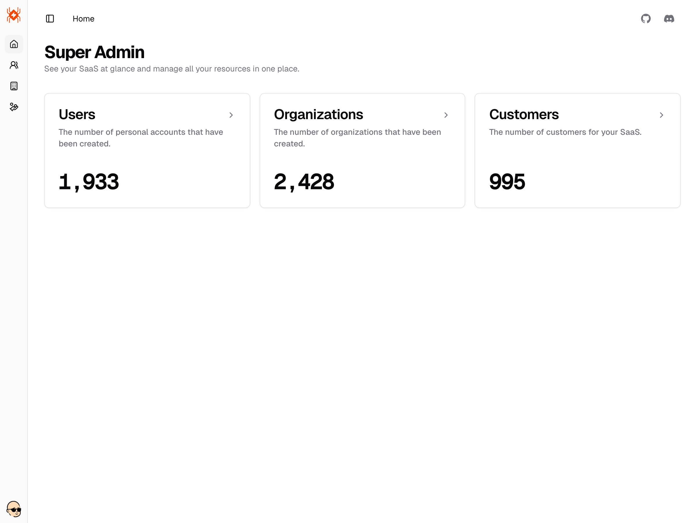
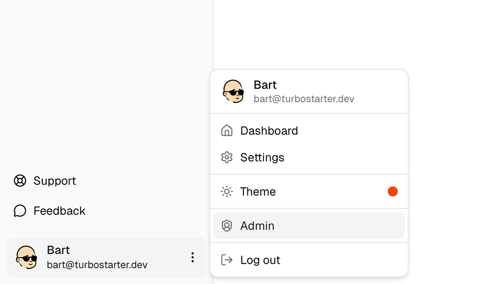

Astra ships with a fully functional admin dashboard - it's a comprehensive tool for managing your application and users from one central place.

The panel is designed to be intuitive and easy to use, while being customizable and scalable at the same time. You can access it at [/admin](http://localhost:3000/admin).



## Roles and permissions

With the initial configuration, your app has two roles available to users: `user` and `admin`. By default, all users are created with the `user` role.

To access the admin dashboard, a user must have the `admin` permission.

```ts
const UserRole = {
  USER: "user",
  ADMIN: "admin",
} as const;
```

You can, of course, define more roles and assign granular permissions, but we recommend keeping the number of roles to a minimum.

## Making a user an admin

To promote a user to the admin role, use your database provider's UI or leverage our built-in [Studio](/docs/web/database/overview#studio). After you find the user you want to promote, change their role from `user` to `admin`.

**Ensure the user you are promoting truly requires admin privileges, as they will gain access to all resources and permissions.**

<Callout title="Recommendations">
  To determine whether a user is eligible for the `admin` role, review the following recommendations before promoting the user:

- The user's email is verified
- Two-factor authentication (2FA) is enabled
- The user is **not** banned or reported

</Callout>

<Callout title="Testing locally">
  By default, when you [run services](/docs/web/installation/commands#setting-up-services) for the first time, your database is [seeded](/docs/web/installation/commands#seeding-database) with example data. This includes an admin user with test credentials that you can use to test admin functionality locally.

```json
{
  "email": "me+admin@astra.dev",
  "password": "Pa$$w0rd"
}
```

You can modify these by setting the `BETTER_AUTH_ADMIN_EMAIL` and `BETTER_AUTH_ADMIN_PASSWORD` environment variables in the `.env.local` file and running the seed process again.

**This flow is for local testing purposes only. Do not use it in production.**

</Callout>

## Dashboard

The admin dashboard is your **central place** to manage your application. It includes management tools for each resource you have defined.

Users with the `admin` permission will see an additional dropdown item in the navigation menu, allowing them to access the admin dashboard.



Explore each section of the page below to familiarize yourself with the available tools and options.
