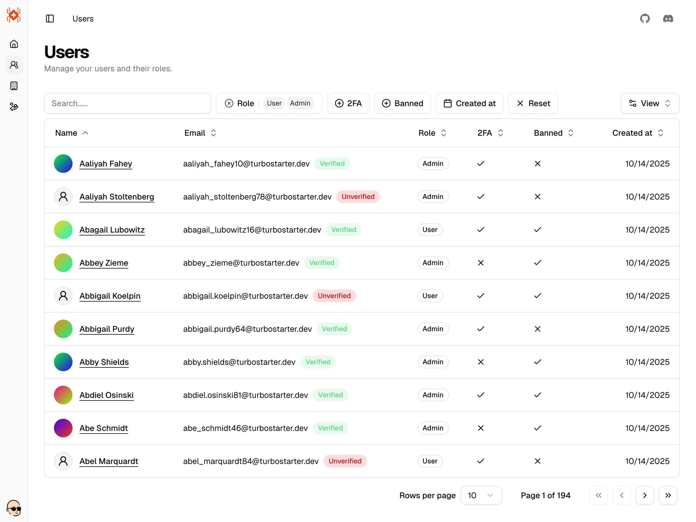
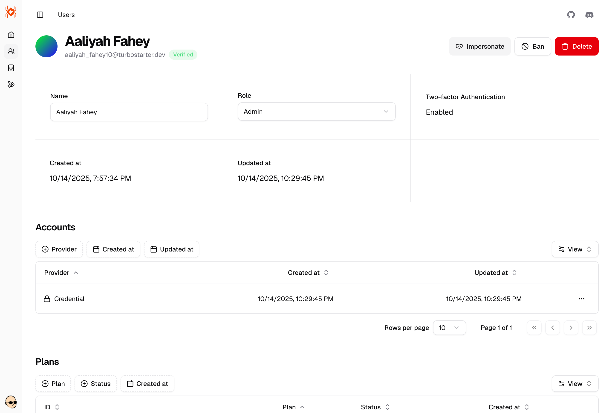
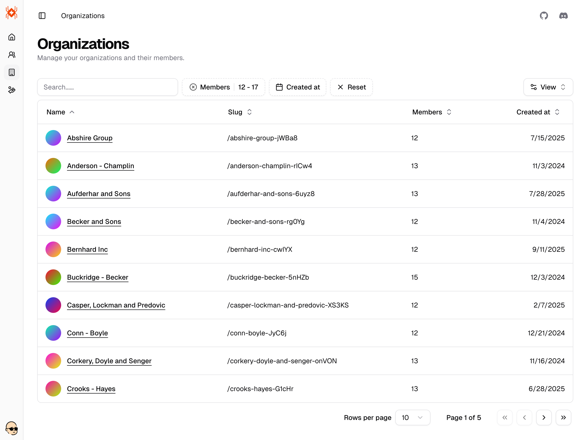
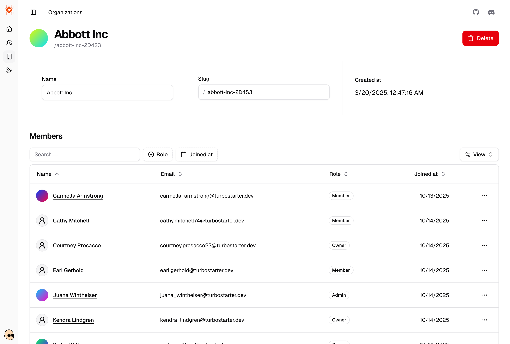
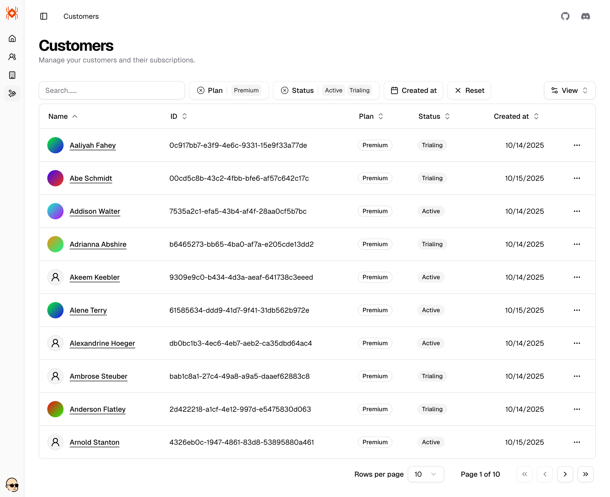

When you open [/admin](http://localhost:3000/admin), you will see the homepage of the admin dashboard. It includes some quick actions and a summary of the resources you have in your application. Feel free to customize it to your needs.

To simplify navigation, we also shipped a sidebar that you can use to navigate between different sections and access all admin capabilities.

Check below for more details about each section.

## Users

Central place to manage your users. You can see the list of users, search and filter them e.g. by role, 2FA, banned state, and created date.

Use it to quickly find users that you need to manage or to see how your SaaS is performing.

When you click on a user, you will see the user details. You can edit the user's name and role, view the user's 2FA status, and see the user's created/updated timestamps.

You can also see and manage the resources related to this specific user like user's connected accounts/providers, subscriptions, memberships, etc.

Beyond simply viewing user information, the admin dashboard enables you to perform a variety of essential user management actions, including:

- **Impersonate the user**: Temporarily log in as the selected user to troubleshoot their experience, verify permissions, or offer assistance directly from their perspective.
- **Ban or unban the user**: Restrict access to your application by banning users who violate terms of service, or lift restrictions when appropriate by unbanning them.
- **Delete the user**: Permanently remove a user and any associated data from your system when necessary, such as for GDPR compliance or at user request.

These administrative actions help you maintain a secure, compliant, and user-friendly environment for your SaaS platform.

## Organizations

See how your multi-tenancy is performing in an elegant way presented as a data table. You can search and filter organizations by name, slug, member count and many more.

In the single organization view, you can get an overview of the specified organization, e.g see its members or invitations that are associated with it.

Here are some example actions you can perform when managing an organization:

- **Edit organization details**: Change the organization name, slug, or other profile information.
- **Invite or remove members**: Add new users to an organization or revoke access from existing members.
- **Change member roles**: Promote a member to an admin or downgrade their access.
- **View and manage invitations**: See pending invites and revoke them if needed.
- **Delete organization**: Remove an organization and all its related data (action usually restricted to super admins).
- **Impersonate organization admin**: Temporarily assume the perspective of an organization's admin for troubleshooting.
- **Audit activity**: View a history of actions taken within the organization for security and compliance.

These actions help you maintain control over multi-tenant environments and ensure that your SaaS remains secure and organized.

## Customers

Manage your customers and their subscriptions. Use search, filters, and sorting to quickly find the right record and understand billing state at a glance.

A few example actions you can perform when managing a customer:

- **Open a customer** to view subscription details and billing history.
- **Change subscription plan** or move a customer to a different tier.
- **Start or extend a trial**, or **cancel a subscription** when needed.
- **Update billing details** like billing email and tax information.
- **Delete customer** to remove them and their billing profile (restricted action).

## Add your own resources

It’s your admin panel at the end of the day - extend it with any domain‑specific resources your product needs. The UI ships with reusable table, filter, form, and layout primitives so you can compose new sections quickly.

To make CRUD panels fast to build, we also provide dedicated hooks, UI components, and API helpers that handle the boring plumbing - data fetching, pagination, sorting, filters, and mutations — so you can focus on your domain logic instead of boilerplate.

<Steps>
  <Step>
    ### Start from an example

    Duplicate an existing resource (like `Users` or `Organizations`) as a baseline and adjust the schema/columns to your needs.

  </Step>

  <Step>
    ### Build the list view

    Compose a data table with columns, sorting, full‑text search, and filters using the shipped primitives.

    Leverage the dedicated hooks, UI components, and API helpers to handle fetching, pagination, sorting, filters, and mutations with minimal boilerplate.

  </Step>

  <Step>
    ### Add a details view

    Create a single‑resource page and, if helpful, add tabs for related entities (e.g., memberships, invoices) using the same building blocks.

  </Step>

  <Step>
    ### Wire up navigation

    Register your route in the admin sidebar so the new resource appears alongside the built‑ins.

  </Step>

  <Step>
    ### Secure with permissions

    Protect access using your RBAC rules and feature flags to control who can view or manage the resource.

  </Step>
</Steps>

Et voilà! You now have a new resource in your admin panel 🥳
