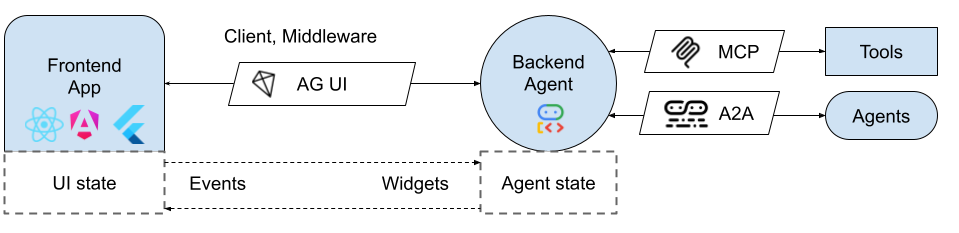
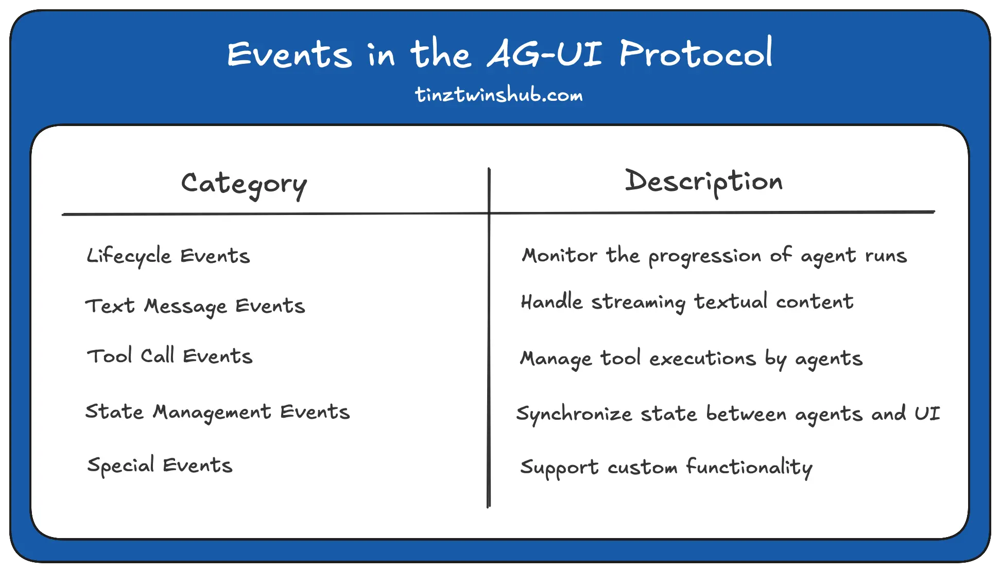
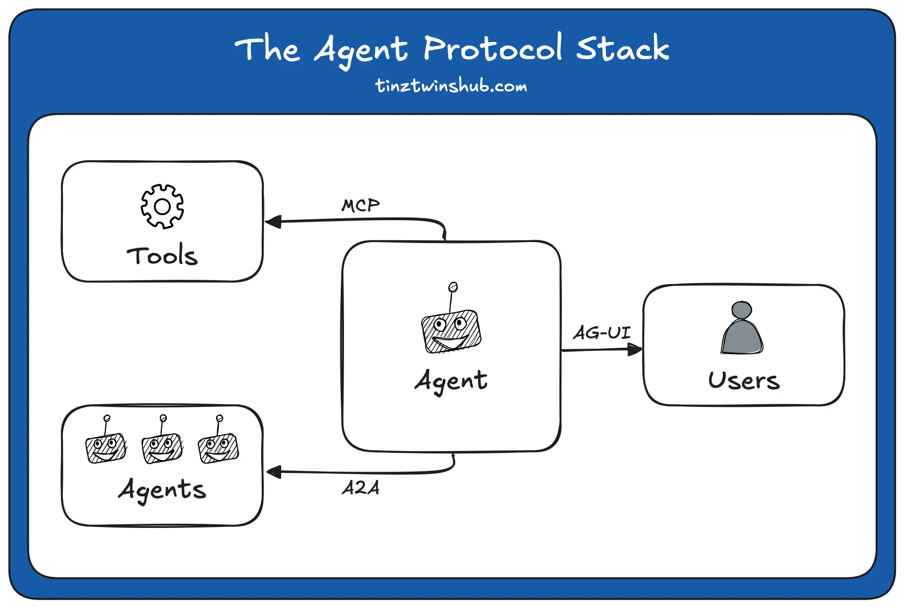

## Overview

The _Agent User Interaction Protocol (AG-UI)_ standardizes the connection of frontend applications with AI agents through an open protocol. You can think of AG-UI as a universal translator for AI-driven systems.

## Architecture of the AG-UI Protocol

The [Agent User Interaction Protocol](https://docs.ag-ui.com/introduction) (AG-UI) uses a flexible and event-driven architecture that enables efficient communication between frontend applications and AI agents.

AG-UI follows a client-server architecture that standardizes communication between AI agents and an application. The following figure shows the architecture.



- **Application**: Chatbot or another AI application
- **AG-UI Client**: Generic communication clients or specialized clients for - connecting with existing protocols
- **Agents**: AI agents that process requests and generate streaming responses
- **Secure Proxy**: Backend services that provide additional capabilities

### Events in the AG-UI Protocol

In the AG-UI protocol, events are the fundamental communication unit between AI agents and frontend apps, enabling structured interaction in real-time.

The events can be divided into different categories. Here is an overview:



### Comparison with other protocols

AG-UI focuses on the interaction between the agent and the user. Together with the A2A (Agent-to-Agent Protocol) and [MCP (Model Context Protocol)](https://modelcontextprotocol.io/introduction), it forms a solid protocol stack.

#### The Agent Protocol Stack 🔥

- MCP connects agents to tools.
- A2A enables agents to communicate with other agents.
- AG-UI connects agents to users
  

For example, the same agent can communicate with another agent via A2A while interacting with the user through AG-UI and simultaneously calling tools provided by an MCP server.

AG-UI is just one piece of the puzzle. It is an important part of the new Agent Protocol Stack, along with the Model Context Protocol (MCP) for connecting tools and the Agent-to-Agent (A2A) protocol for communication between agents.

## Testing

```shell
turbo run web#dev
# Opens http://localhost:3000/playground/weather
```

**Try these interactions:**

- "Add a proverb about AI"
- "Set the theme to orange"
- "Get the weather in San Francisco"
- "Remove the first proverb"

## Reference

- [How to Expose Your Agno Agent as an AG-UI Compatible App](https://tinztwinshub.com/software-engineering/how-to-expose-your-agno-agent-as-an-ag-ui-compatible-app/)
- [Build a Fullstack Stock Portfolio Agent with LangGraph and AG-UI](https://dev.to/copilotkit/build-a-fullstack-stock-portfolio-agent-with-langgraph-and-ag-ui-5da0)
- [google ADK with AG-UI](https://developers.googleblog.com/en/delight-users-by-combining-adk-agents-with-fancy-frontends-using-ag-ui/)

## TODO

- [AGUI gomoku demo](https://github.com/ag-ui-protocol/ag-ui/pull/145)
- [FinLLM Apps](https://github.com/tinztwins/finllm-apps)
- [AG-UI Mastra Workshop](https://github.com/CopilotKit/mastra-pm-canvas)
- [open-ag-ui-demo-mastra](https://github.com/TheGreatBonnie/open-ag-ui-demo-mastra)
