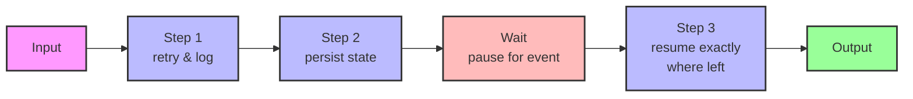
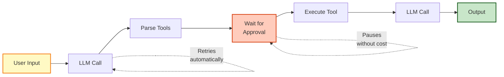
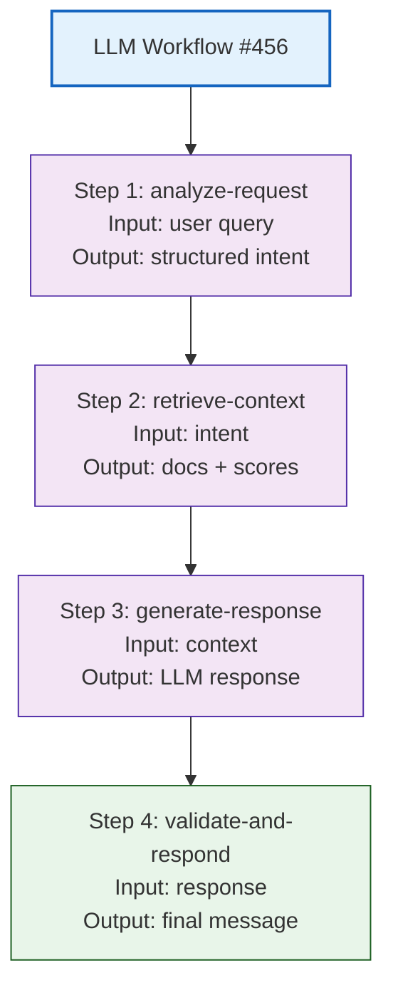
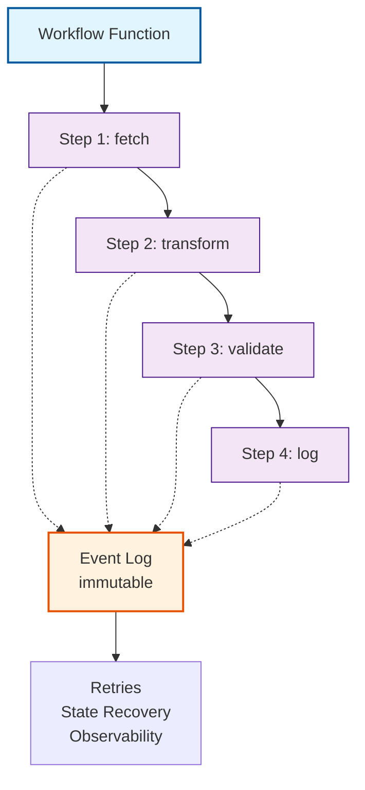
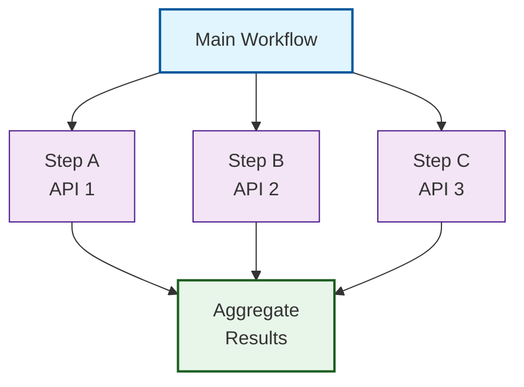

Workflows are a programming model that transforms how developers build reliable, long-running async operations. Rather than manually orchestrating complex infrastructure—message queues, retry logic, state management—workflows make durability a first-class language feature, letting you write resilient code that looks like ordinary functions.

## Core Idea

A workflow is a long-running, durable function composed of isolated steps that automatically persist progress, retry on failure, and survive crashes or deployments. Each step is independently retryable and observable, with built-in semantics for pausing, resuming, and waiting for external events.

The mental model shifts from _"I need to coordinate multiple services"_ to _"I write a single function that can pause, wait, and continue reliably."_



Each step execution is recorded in an immutable event log, making the entire workflow auditable and resumable from any point, even after infrastructure failures.

## Features

### 1. **Durable Step Execution**

Break work into isolated steps that each:

- Automatically retry on transient failures
- Persist their input and output
- Have built-in error handling
- Can be re-executed from scratch or skipped based on idempotency

Steps divide responsibilities: one step calls an API, another transforms data, another triggers a notification. Each is independently trackable.

### 2. **Sleep & Scheduling**

Pause execution for minutes, hours, or days without consuming resources. Unlike traditional serverless functions that timeout, workflows naturally suspend and resume.

```javascript
// Sleep for a week without infrastructure
await workflow.sleep(7 * 24 * 60 * 60 * 1000);
// Resume exactly where paused, with full context intact
```

Perfect for delays in business logic: reminding users of trial expiration, scheduled emails, or waiting for periodic data sync.

### 3. **Event Handling & Human-in-the-Loop**

Pause waiting for external events: webhooks, user approvals, third-party API callbacks. The workflow holds state without polling or continuous resource consumption.

```javascript
// Pause until a webhook arrives
const approval = await workflow.waitForEvent("user-approval");
// Resume with the event data
if (approval.approved) {
  // Continue...
}
```

Enables workflows that integrate external approvals, manual interventions, or third-party confirmations seamlessly.

### 4. **Observability by Default**

Every step, input, output, pause, and error is recorded in an immutable event log. No additional instrumentation needed. Tools provide:

- Step-level execution timing
- Full input/output inspection
- Error traces with context
- State at each pause point

```
Step 1: fetch-user-data
  Input: { userId: "123" }
  Duration: 245ms
  Output: { name: "Alice", email: "alice@..." }
  Status: success

Step 2: send-email
  Input: { email: "alice@...", subject: "..." }
  Duration: 1203ms
  Output: { messageId: "msg_456" }
  Status: success
```

### 5. **Automatic Lifecycle Management**

Control workflows programmatically:

- Trigger new runs with input data
- Pause/resume running workflows
- Terminate on demand
- Query run status and history

State is managed automatically; you don't manually track progress in a database.

### 6. **Portability Across Environments**

Write once, run locally for development or scale to production without code changes. A single workflow codebase runs in:

- Local development loops
- Self-hosted Docker containers
- Cloud platforms (AWS, DigitalOcean, Vercel)
- Multiple language runtimes (TypeScript, Python, etc.)

## Use Cases

### AI Agents & LLM Applications

Workflows excel for agent loops that make multiple API calls with natural pauses:

- **Multi-turn conversations**: pause while awaiting user input, resume with context intact
- **Tool invocation loops**: call external APIs, check results, decide next step—all with automatic retry and observability
- **Long-running analyses**: process documents, invoke embeddings, wait for compute-heavy steps without resource waste
- **Streaming with persistence**: pause mid-stream to save progress, resume on crash without losing tokens



### Data Pipelines & ETL

Multi-hour or multi-day data operations that must survive crashes:

- **Batch imports**: fetch → transform → validate → load, with automatic retries at each step
- **Distributed ingestion**: ingest from multiple sources in parallel steps, pause for rate limits
- **RAG systems**: chunk documents → embed → store, maintaining exact progress across deployments
- **Data reconciliation**: compare, sync, and audit across systems with full operation history

### Commerce & Fulfillment

Long-lived business workflows:

- **Order processing**: validate payment → reserve inventory → [wait for shipping label] → notify customer
- **Trial expiration**: create trial → [wait N days] → check usage → send renewal offer → [wait for decision]
- **Subscription lifecycle**: onboard → [wait for payment] → [wait for churn risk] → engage or cancel

### Integrations & Webhooks

Reliably consume and orchestrate external events:

- **Third-party synchronization**: pull data from API → transform → post to another system, with guaranteed delivery
- **Event-driven orchestration**: subscribe to webhooks, enrich, fan out to multiple services
- **Approval workflows**: pause awaiting human decision from external approval system, resume with decision data

## How Workflows Help AI Automation

Workflows and AI automation are natural partners:

### 1. **Resilient Agent Loops**

AI agents make multiple sequential API calls with thinking/planning steps. Each call can fail (rate limits, timeouts, API errors). Workflows provide:

- Automatic retry with exponential backoff
- Step-level isolation (agent thinks, then calls API, then evaluates)
- Natural pause points for human review before committing actions
- Full audit trail of agent reasoning and decisions

### 2. **Token & Cost Efficiency**

Long-running agent tasks often include expensive waiting periods (API responses, human decisions, compute). Workflows:

- Pause without resource cost when awaiting external input
- Resume exactly where paused, no token waste on re-context
- Record execution timeline, enabling cost analysis per workflow instance

### 3. **Integration with AI/LLM Platforms**

Workflows pair naturally with:

- **Streaming**: pause between stream chunks, resume and continue processing
- **Tool calling**: step per tool invocation, automatic retry if tool fails
- **Memory/state management**: workflow engine persists context across steps; no need to manually load/save embeddings or conversation history
- **Batch processing**: fan out multiple agent instances on workflow steps, gather results

### 4. **Observable, Debuggable AI Systems**

Visibility into agent behavior is critical for production LLM apps:

- See exact input/output of each LLM call
- Inspect intermediate reasoning at each step
- Replay workflows to debug unexpected behavior
- Audit decisions made by AI agents for compliance



### 5. **Human-in-the-Loop Automation**

Workflows enable workflows that gracefully involve humans:

- Pause before irreversible actions (deletion, large transfers) for human approval
- Integrate manual review gates without rebuilding orchestration
- Resume automated flow after human decision with original context intact

Example: content moderation workflow pauses for human review if confidence is low, resumes automatically with human decision embedded.

## Architecture Patterns

### Single-Threaded Orchestration



One function orchestrates all steps; coordination logic lives in your code, not in separate infrastructure.

### Distributed Step Execution

For parallelism, workflows fan out steps:



Individual steps retry independently; the parent workflow waits for all to complete before proceeding.

## Comparison to Traditional Approaches

| Aspect                | Message Queues                 | Saga Pattern                           | **Workflows**                  |
| --------------------- | ------------------------------ | -------------------------------------- | ------------------------------ |
| **State Management**  | Manual, external DB            | Distributed, compensations             | Built-in, persistent           |
| **Development**       | Coordinator + multiple workers | Multiple services + compensation logic | Single function                |
| **Observability**     | Logs scattered across services | Implicit from sagas                    | Event log native               |
| **Retry Logic**       | Manual per queue               | Per service, complex                   | Automatic per step             |
| **Pause/Resume**      | Re-enqueue on delay            | Not natural                            | Native, zero-cost              |
| **Debugging**         | Reconstruct from logs          | Trace across services                  | Step-by-step replay            |
| **Deployment Impact** | Migrations needed              | Backwards-compatible compensations     | Seamless pauses across deploys |

## Key Takeaways

1. **Workflows simplify async**: Write long-running logic as a single function, not distributed microservices.
2. **Durability is automatic**: Step persistence, retries, and state recovery are built-in; no extra infrastructure needed.
3. **Observability is native**: Every step execution is recorded; debugging and auditing require no extra instrumentation.
4. **Perfect for AI**: Agents, LLMs, and multi-step automations gain resilience, observability, and cost efficiency naturally.
5. **Production-ready**: Workflows survive crashes, deployments, and failures; your code defines the contract, not infrastructure.

Workflows represent a shift from _managing infrastructure_ to _writing reliable application logic_. They're particularly powerful for AI automation, where multi-step reasoning, external API integration, and audit trails are essential.
