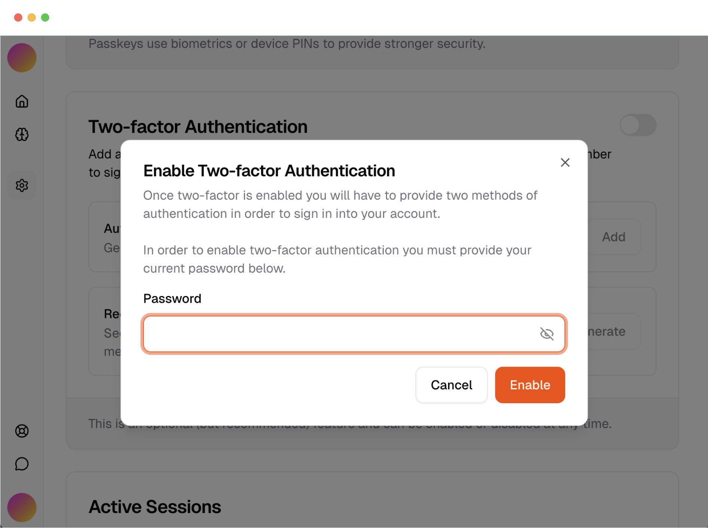
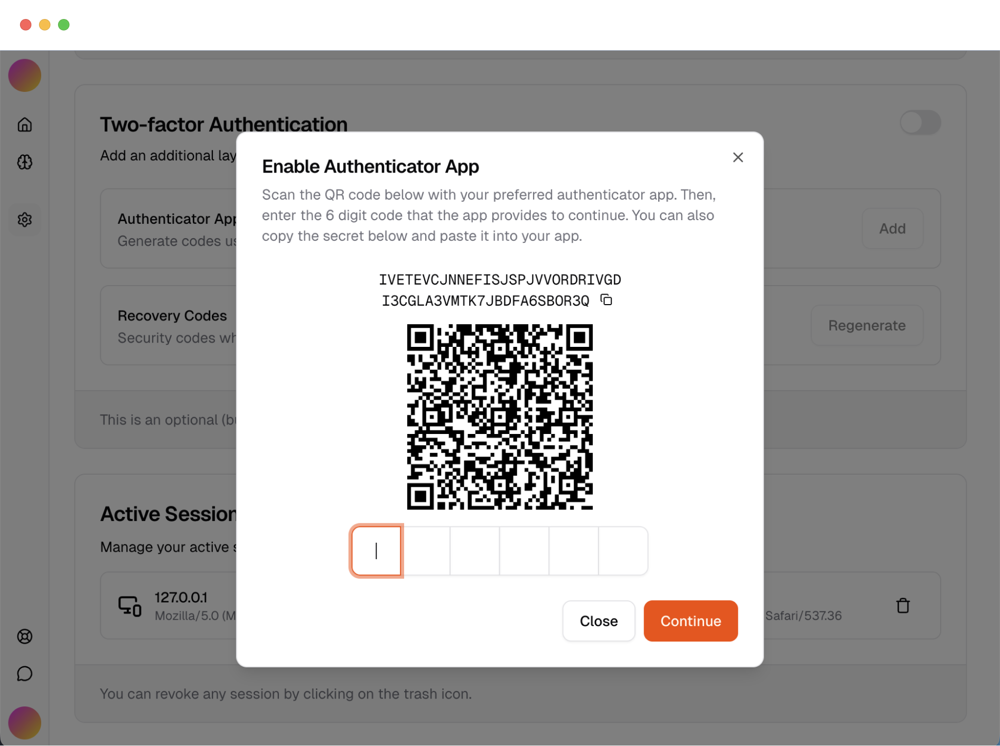
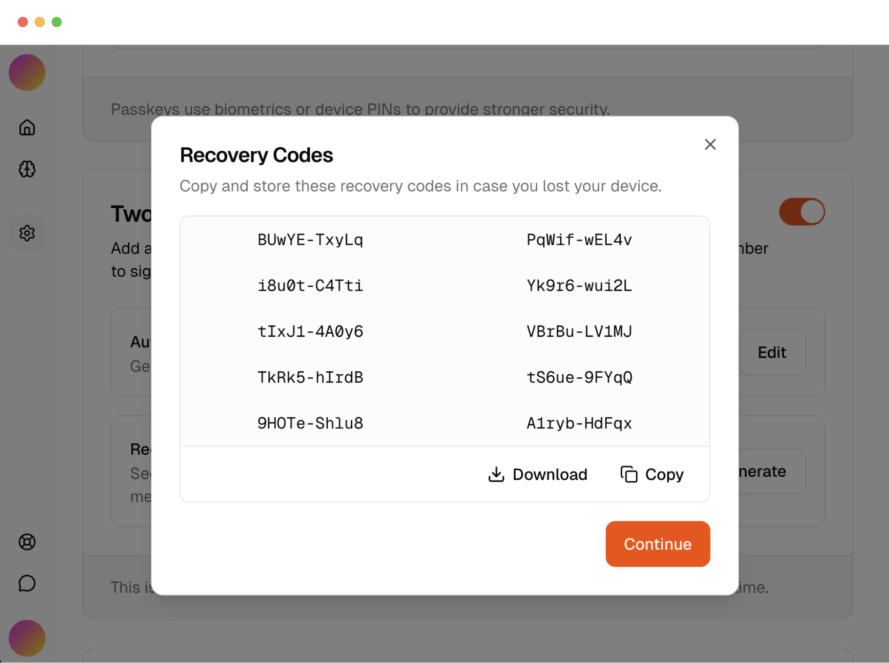

Astra uses [Better Auth's 2FA plugin](https://www.better-auth.com/docs/plugins/2fa) to provide multi-factor authentication (MFA) capabilities. Two-factor authentication adds an extra layer of security by requiring users to provide a second form of verification alongside their password.

## Available methods

Astra supports multiple 2FA verification methods through Better Auth:

- **TOTP (Time-based One-Time Password)** - codes generated by authenticator apps
- **OTP (One-Time Password)** - codes sent via email or SMS
- **Backup codes** - single-use recovery codes for account recovery

You can use any TOTP-compatible authenticator app, such as:

- [Google Authenticator](https://support.google.com/accounts/answer/1066447)
- [Authy](https://authy.com/)
- [Microsoft Authenticator](https://www.microsoft.com/en-us/security/mobile-authenticator-app)
- [1Password](https://1password.com/features/authenticator/)
- [Bitwarden](https://bitwarden.com/help/authenticator-keys/)

## Enabling 2FA

<Steps>
  <Step>
    ### Enable in settings

    Users enable two-factor authentication in their account security settings.

    

  </Step>

  <Step>
    ### Setup authenticator

    A QR code is displayed for users to scan with their authenticator app.

    

  </Step>

  <Step>
    ### Verify setup

    Users enter a verification code from their authenticator to confirm setup.

  </Step>

  <Step>
    ### Backup codes

    Users receive single-use backup codes for account recovery.

    

  </Step>
</Steps>

<Callout type="info">
  Recovery codes are essential for account recovery if users lose access to their authenticator
  device. Make sure to educate users about safely storing their backup codes.
</Callout>

## Using 2FA

<Steps>
  <Step>
    ### Sign in normally

    Users enter their email and password or other methods as usual.

  </Step>

  <Step>
    ### 2FA prompt

    After successful password verification, users are prompted for their 2FA code.

    

  </Step>

  <Step>
    ### Enter verification code

    Users input the 6-digit code from their authenticator app.

  </Step>

  <Step>
    ### Access granted

    Upon successful verification, users gain access to their account.

  </Step>
</Steps>

### Trusted devices

Users can mark devices as trusted during 2FA verification. Trusted devices won't require 2FA verification for 60 days, providing a balance between security and convenience.

## Configuration

2FA is configured through Better Auth's plugin system. The plugin handles:

- Secure secret generation and storage
- QR code generation for authenticator setup
- TOTP code validation
- Backup code generation and management
- Trusted device management

For detailed implementation instructions, refer to the [Better Auth 2FA documentation](https://www.better-auth.com/docs/plugins/2fa).
