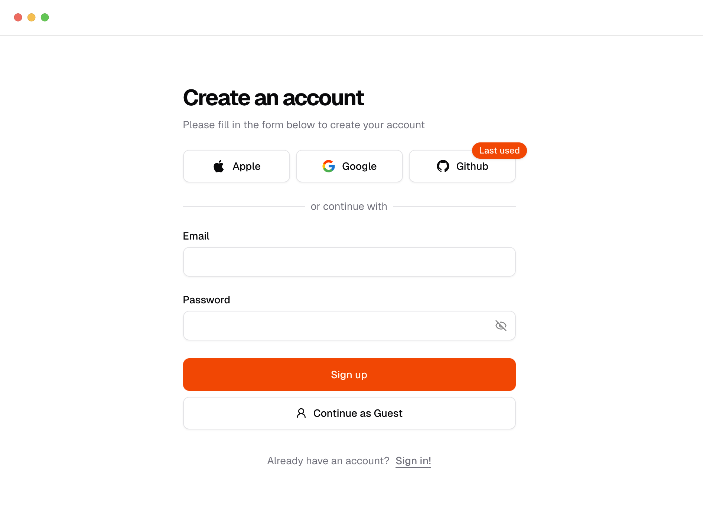
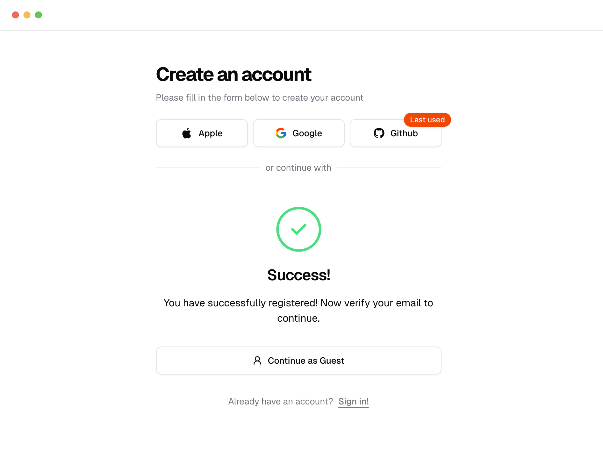
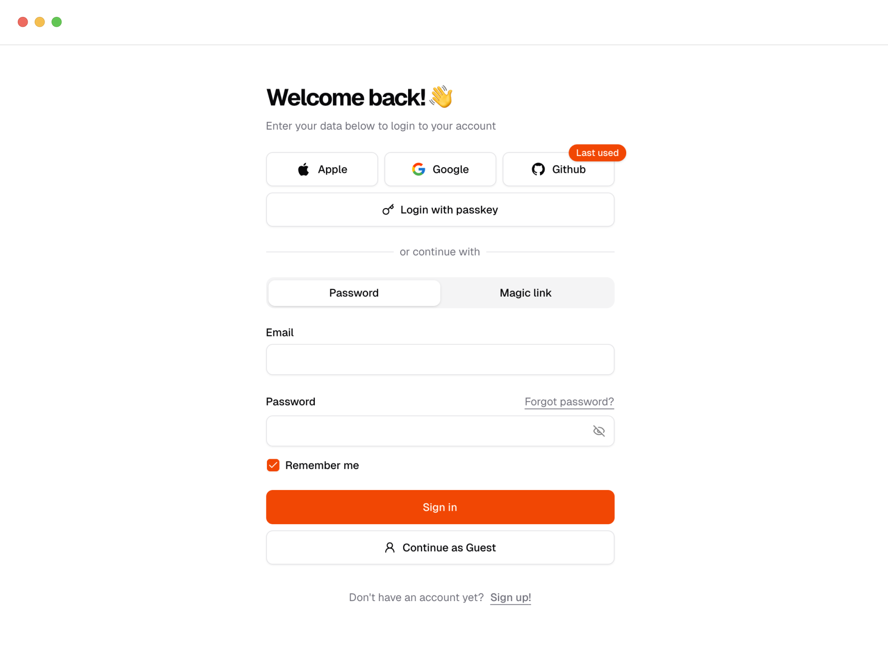
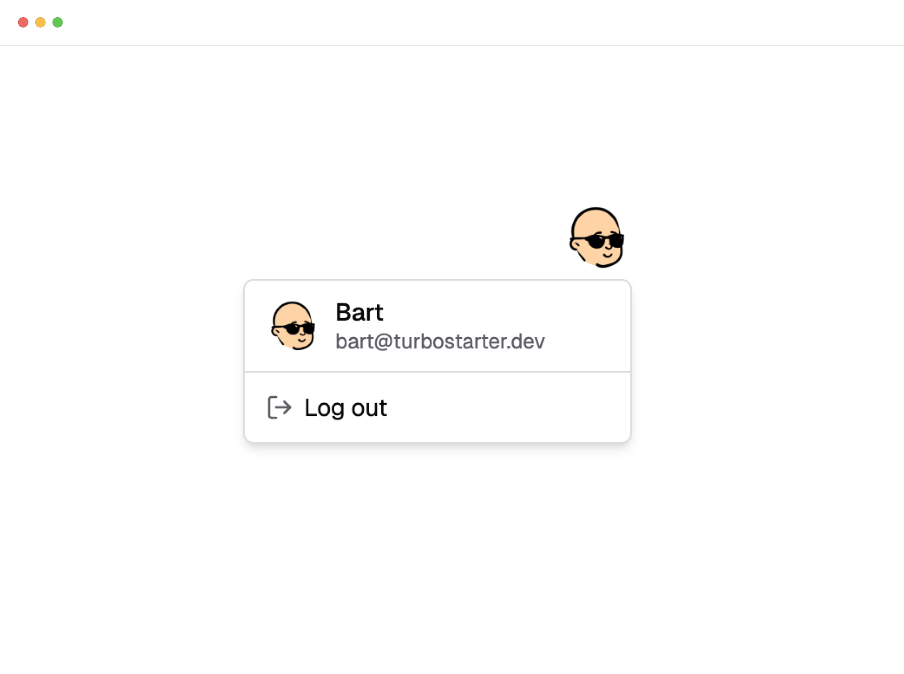
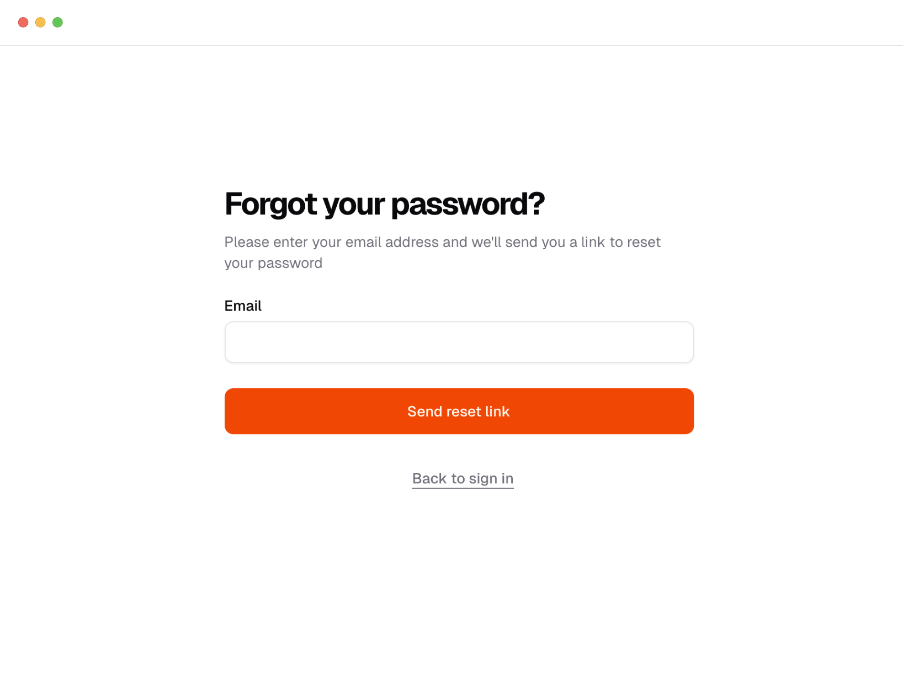
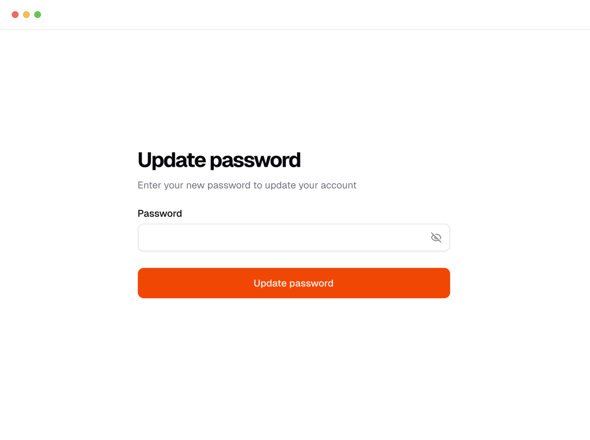
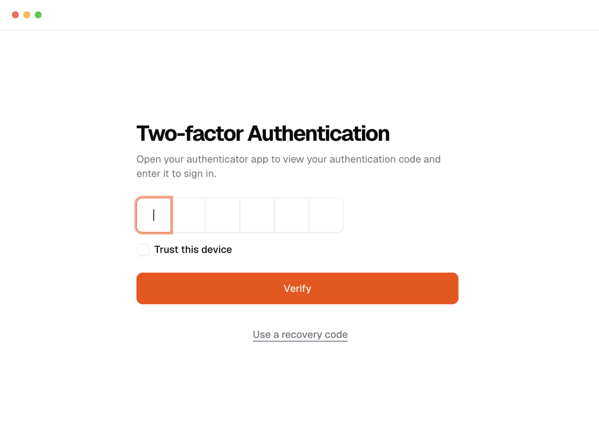

Astra ships with a fully functional authentication system. Most of the views and components are preconfigured and easily customizable to your needs.

Here you will find a quick walkthrough of the authentication flow.

## Sign up

The sign-up page is where users can create an account. They need to provide their email address and password.

Once successful, users are asked to confirm their email address. This is enabled by default - and due to security reasons, it's not possible to disable it.

<Callout type="warn" title="Sending authentication emails">
  Make sure to configure the [email provider](/docs/web/emails/configuration) together with the
  [auth hooks](/docs/web/emails/sending#authentication-emails) to be able to send emails from your
  app.
</Callout>

## Sign in

The sign-in page is where users can log in to their account. They need to provide their email address and password, use magic link (if enabled) or third-party providers.

## Sign out

The sign out button is located in the user menu.

## Forgot password

The forgot password page is where users can reset their password. They need to provide their email address and follow the instructions in the email.

The reset password page is where users land from a forgot email. There they can reset their password by providing new password and confirming it.

## Two-factor authentication

Two-factor authentication is a security feature that requires users to provide a code sent to their email or phone number in addition to their password when logging in.

