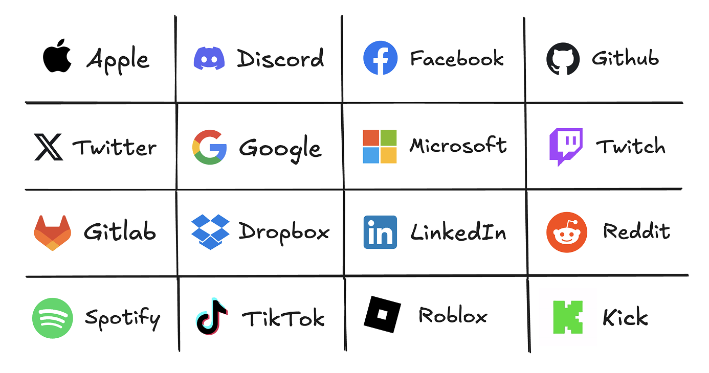

Better Auth supports over **30** (!) different [OAuth providers](https://www.better-auth.com/docs/concepts/oauth). They can be easily configured and enabled in the kit without any additional configuration needed.

<Callout title="Everything configured out of the box!">
  Astra provides you with all the configuration required to handle OAuth providers responses from your app:

- redirects
- middleware
- confirmation API routes

You just need to configure one of the below providers on their side and set correct credentials as environment variables in your Astra app.

</Callout>



Third Party providers need to be configured, managed and enabled fully on the provider's side. Astra just needs the correct credentials to be set as environment variables in your app and passed to the [authentication API configuration](/docs/web/auth/configuration#api).

To enable OAuth providers in your Astra app, you need to:

1. Set up an OAuth application in the provider's developer console (like [Apple Developer Portal](https://developer.apple.com/account/), [Google Cloud Console](https://console.cloud.google.com/), [Github Developer Settings](https://github.com/settings/developers) or any other provider you want to use)
2. Configure the provider's credentials as environment variables in your app. For example, for Google OAuth:

```dotenv title="apps/web/.env.local"
GOOGLE_CLIENT_ID=
GOOGLE_CLIENT_SECRET=
```

Then, pass it to the authentication configuration in `packages/auth/src/server.ts`:

```ts title="server.ts"
export const auth = betterAuth({
  ...

  socialProviders: {
    [SocialProvider.GOOGLE]: {
      clientId: env.GOOGLE_CLIENT_ID,
      clientSecret: env.GOOGLE_CLIENT_SECRET,
    },
  },

  ...
});
```

<Callout title="Missing provider?">
  Better Auth provides a [generic OAuth plugin](https://www.better-auth.com/docs/plugins/generic-oauth) that allows you to add any OAuth provider to your app.

It supports both OAuth 2.0 and OpenID Connect (OIDC) flows, allowing you to easily add social login or custom OAuth authentication to your application.

</Callout>
