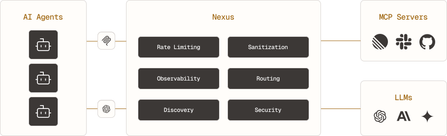

## Overview

## AI SDKs

- [AI SDK Guardrails](https://github.com/jagreehal/ai-sdk-guardrails)
- [AI Tools Registry](https://ai-tools-registry.vercel.app/) - Install AI SDK tools into your project with the shadcn CLI. [Repo](https://github.com/xn1cklas/ai-tools-registry)
- [AI SDK Tools](https://ai-sdk-tools.dev/) - AI SDK Zustand eliminates prop drilling within your chat components, ensuring better performance and cleaner architecture
- [AI SDK Agents](https://www.aisdkagents.com/) - 77 AI SDK Patterns. You can Copy & Paste.
- [Tanstack AI](https://tanstack.com/ai/latest)
- [Browser AI](https://www.browser-ai.dev/)
- [Better Agent](https://www.better-agent.com/) - Typed Agents, Type-Safe Client, Plugins, Event Driven, Human in the Loop, Durable, Structured Output
- [Vercel Eve](https://vercel.com/eve) - The framework for building agents.
  - Eve components - [agentcn](https://www.agentcn.run/)
  - Eve [Personal Agent Template](https://github.com/vercel-labs/personal-agent-template)

## MCP Gateways

- [mindsdb](https://github.com/mindsdb/mindsdb) - MindsDB enables humans, AI, agents, and applications to get highly accurate answers across large scale data sources.
- [metamcp](https://github.com/metatool-ai/metamcp) - MCP Aggregator, Orchestrator, Middleware, Gateway in one docker. [Docs](https://docs.metamcp.com/en)
- [nexus](https://nexusrouter.com/) - The AI router - MCP Server Aggregation - LLM Provider Routing - Context-Aware Tool Search - Self Host

## LLM Gateways

- Vercel [AI Gateway](https://vercel.com/ai-gateway)
- Cloudflare [AI Gateway](https://developers.cloudflare.com/ai-gateway/)

## AI Evals

- Mastra [scorers](https://mastra.ai/en/docs/scorers/overview)
- [Agno Agent Evals](https://docs.agno.com/evals/introduction)
- [OneRun AI](https://docs.onerun.ai/)
- [Google Stax](https://stax.withgoogle.com/landing/index.html)
- [Evalite](https://www.evalite.dev/) - Test AI-powered apps in TypeScript, Vitest
- [Open Evals](https://open-evals.com/) - support Synthetic Data Generation, specialized for RAG Agents. sample [code](https://github.com/cantemizyurek/open-evals/tree/main/agents/doc-assistant)

## AI Observability

**OpenTelemetry** compatible backends including `Arize Phoenix`, `Langfuse`, `Langsmith`, `Langtrace`, `LangWatch`

## Sandboxes

- [Edge.js](https://edgejs.org/) - Run AI Agents and other JS workloads in secure sandbox without docker. examples: [QueenMQ](https://queenmq.com/) subscription workflows
- [Secure Exec](https://secureexec.dev/docs/sdk-overview) - examples [AI Agent Code Exec](https://secureexec.dev/docs/use-cases/ai-agent-code-exec)

## Libs

- [json-render](https://json-render.dev/)

## Starter Kits

- [canvas-with-mastra](https://github.com/CopilotKit/canvas-with-mastra) - CopilotKit - Mastra AG-UI Canvas Starter
- [ai-chatbot](https://github.com/vercel/ai-chatbot) - A full-featured, hackable Next.js AI chatbot built by Vercel
- [Generative UI for Agentic Apps](https://github.com/CopilotKit/generative-ui) - AG-UI , A2UI, Open-JSON-UI, MCP Apps, [Deck](https://github.com/CopilotKit/generative-ui/blob/main/assets/generative-ui-guide.pdf)

## Blogs

- [AI Agent Stack](https://www.agentsworkshop.ai/p/my-production-ai-agent-stack) - **NEXT.js** (runtime), **Vercel AI SDK** (LLM core logic), **Mastra** (agentic framework), **AI Elements** (UI components), **Mem0** (memory layer), **OpenTelemetry & SigNoz** (traces), Vercel (deploy)
- [How we built Agent Builder’s memory system](https://x.com/hwchase17/status/2011814697889316930)
- [Retrieve and Rerank: Personalized Search Without Leaving Postgres](https://www.paradedb.com/blog/personalized-search-in-postgresql)

## TODO

- implement applying dynamic MCP to dynamic Agent, based on https://github.com/Sagit-autodesk/hackweek-2025/tree/fe0adde06cda81b8f3d7cbfc570c22d126d64ccf/chrome-client-new
- Mastra with Vercel AI Gateway and AI Elements https://github.com/mattwoodco/mastra-gateway-example
- **Human-in-the-Loop AI Assistant** - AI agent that asks for your approval at every step. Built with [assistant-ui](https://github.com/Yonom/assistant-ui) and **Mastra**.
  - [Repo](https://github.com/assistant-ui/mastra-hitl/tree/main), [Demo](https://aui-mastra-hitl.vercel.app/)
- [CopilotKit + ADK Generative Canvas](https://github.com/CopilotKit/adk-generative-dashboard)
- [Mastra Visual Builder](https://github.com/Khaledgarbaya/mastra-agent-builder)
- [Built-in AI model providers for Vercel AI SDK](https://github.com/jakobhoeg/browser-ai) - package is the AI SDK model provider for your Chrome and Edge browser's built-in AI models. Sample project: [notester](https://github.com/jakobhoeg/notester)
- [Build Canvas/Artifacts with AI SDK](https://github.com/Quintui/ai-sdk-shared-chat/) - example showcase streaming from tools. Provider for sharing context.
  - [Video Guide](https://www.youtube.com/watch?v=loCGXhST8YQ)
- [AI SDK Apple Provider Demo](https://github.com/Quintui/ai-sdk-react-native-apple-provider-example)
