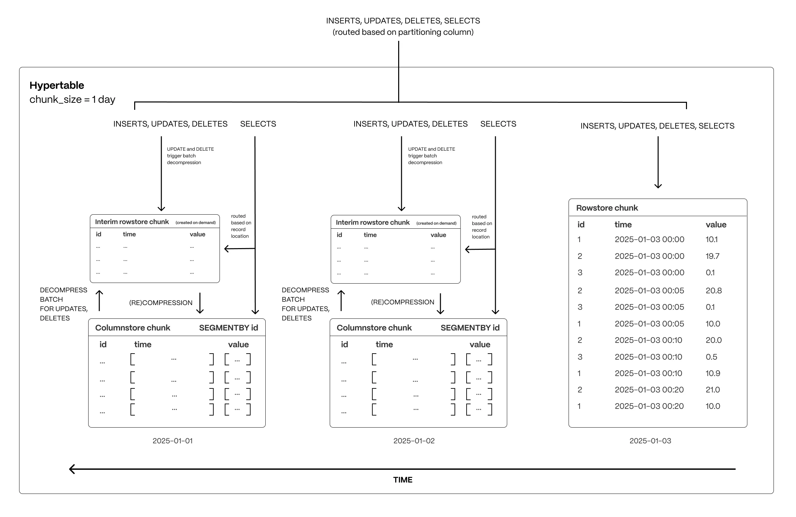

**TimescaleDB** is an open-source, high-performance time-series database optimized for time-based workloads, built as a PostgreSQL extension

**Hypertables:** Automatically partitions data into smaller, manageable chunks based on time, boosting ingest speeds

**Hyperfunctions:** Provides over 100 specialized SQL functions for time-series analysis.

**Row-columnar storage:** providing the flexibility of a row store for transactions and the performance of a column store for analytics

The following figure shows how TimescaleDB optimizes your data for superfast real-time analytics:



## Agent Access Events

Instructions for insert-heavy data patterns where data is inserted but rarely changed:

```sql
CREATE TABLE agent_access_events (
    time TIMESTAMPTZ NOT NULL,

    organization_id UUID NOT NULL,
    agent_id UUID NOT NULL,
    user_id UUID NOT NULL,
    policy_id UUID NOT NULL,

    remote_address TEXT,
    application TEXT NOT NULL,
    shared boolean DEFAULT true NOT NULL,
    metadata JSONB
) WITH (
    tsdb.hypertable,
    tsdb.partition_column='time',
    tsdb.segmentby='agent_id',
    tsdb.orderby='time DESC',
    tsdb.sparse_index='minmax(shared),minmax(application),minmax(remote_address)'
);

CREATE INDEX ON device_access_events (organization_id, time DESC);
CREATE INDEX ON device_access_events (agent_id, time DESC);

SELECT add_retention_policy(
  'device_access_events',
  drop_after => INTERVAL '30 days',
  if_not_exists => true
);
```
