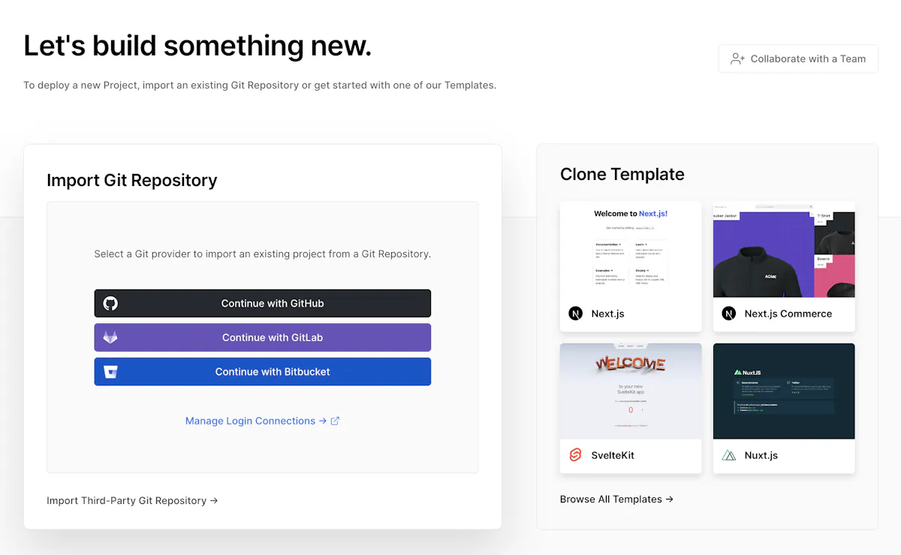
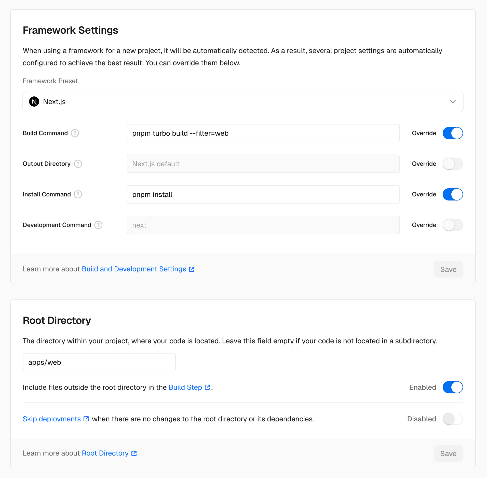
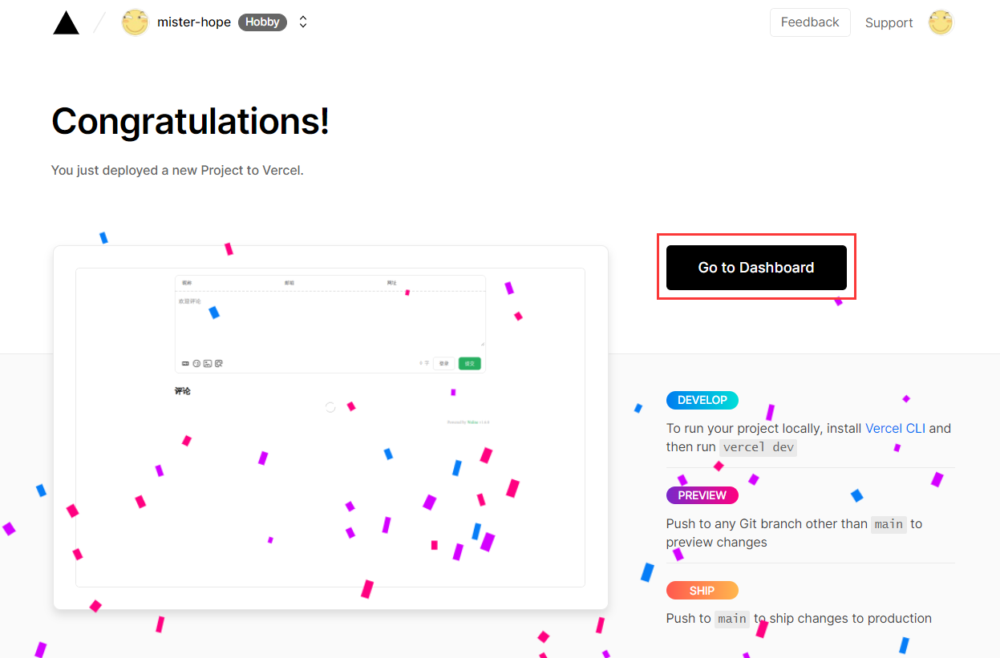

In general you can deploy the application to any hosting provider that supports Node.js, but we recommend using [Vercel](https://vercel.com) for the best experience.

Vercel is the easiest way to deploy Next.js apps. It's the company behind Next.js and has first-class support for Next.js.

<Callout type="warn" title="Prerequisite: Vercel account">
  To deploy to Vercel, you need to have an account. You can create one
  [here](https://vercel.com/signup).
</Callout>

Astra has two, separate ways to deploy to Vercel, each ships with **one-click deployment**. Choose the one that best fits your needs.

<Tabs items={["Connecting repository", "Github Actions"]}>
  <Tab value="Connecting repository">
    Deploying with this method is the easiest and fastest way to get your app up and running on the cloud provider. Follow these steps:

    <Steps>
      <Step>
        ## Connect your git repository

        After signing up you will be promted to import a git repository. Select the git provider of your project and connect your git account with Vercel.

        
      </Step>

      <Step>
        ## Configure project settings

        As we're working in monorepo, some additional settings are required to make the build process work.

        Make sure to set the following settings:

        * **Build command**: `pnpm turbo build --filter=web` - to build only the web app
        * **Root directory**: `apps/web` - to make sure Vercel uses the web folder as the root directory (make sure to check *Include files outside the root directory in the Build Step* option, it will ensure that all packages from your monorepo are included in the build process)

        

        <Cards>
          <Card title="Build and development settings" description="vercel.com" href="https://vercel.com/docs/deployments/configure-a-build#build-and-development-settings" />

          <Card title="Root directory" description="vercel.com" href="https://vercel.com/docs/deployments/configure-a-build#root-directory" />
        </Cards>
      </Step>

      <Step>
        ## Configure environment variables

        Please make sure to set all the environment variables required for the project to work correctly. You can find the list of required environment variables in the `.env.example` file in the `apps/web` directory.

        The environment variables can be set in the Vercel dashboard under *Project Settings* > *Environment Variables*. Make sure to set them for all environments (Production, Preview, and Development) as needed.

        **Failure to set the environment variables will result in the project not working correctly.**

        If the build fails, deep dive into the logs to see what is the issue. Our Zod configuration will validate and report any missing environment variables. To find out which environment variables are missing, please check the logs.

        <Callout title="First deployment may fail">
          The first time this may fail if you don't yet have a custom domain connected since you cannot place it in the environment variables yet. It's fine. Make the first deployment fail, then pick the domain and add it. Redeploy.
        </Callout>
      </Step>

      <Step>
        ## Deploy!

        Click on the *Deploy* button to start the deployment process.

        

        That's it! Your app is now deployed to Vercel, congratulations! 🎉
      </Step>
    </Steps>

  </Tab>

  <Tab value="Github Actions">
    Despite connecting your repository is the easiest way to deploy to Vercel, we recommend using preconfigured Github Actions for the most granular control over your deployments.

    We'll leverage [Vercel CLI](https://vercel.com/docs/cli) to deploy the application on the CI/CD pipeline. [See official documentation on deploying to Github Actions](https://vercel.com/guides/how-can-i-use-github-actions-with-vercel).

    <Steps>
      <Step>
        ## Get Vercel Access Token

        To deploy the application, we need to get Vercel access token.

        Please, follow [this guide](https://vercel.com/guides/how-do-i-use-a-vercel-api-access-token) to create one.


      </Step>

      <Step>
        ## Install Vercel CLI

        We need to install [Vercel CLI](https://vercel.com/docs/cli) locally to be able to get required credentials for our Github Actions.

        You can install it using following command:

        ```bash
        pnpm i -g vercel
        ```

        Then, login to Vercel using following command:

        ```bash
        vercel login
        ```
      </Step>

      <Step>
        ## Get credentials

        Inside your folder, run following command to create a new project:

        ```bash
        vercel link
        ```

        This will generate a `.vercel` folder, where you can find `project.json` file with `projectId` and `orgId`.
      </Step>

      <Step>
        ## Configure Github Actions

        Inside GitHub, add `VERCEL_TOKEN`, `VERCEL_ORG_ID`, and `VERCEL_PROJECT_ID` as [secrets](https://docs.github.com/en/actions/security-for-github-actions/security-guides/using-secrets-in-github-actions) to your repository.


        This will allow Github Actions to access your settings and deploy the application to Vercel.
      </Step>

      <Step>
        ## Configure project settings

        As we're working in monorepo, some additional settings are required to make the build process work.

        Make sure to set the following settings:

        * **Build command**: `pnpm turbo build --filter=web` - to build only the web app
        * **Root directory**: `apps/web` - to make sure Vercel uses the web folder as the root directory (make sure to check *Include files outside the root directory in the Build Step* option, it will ensure that all packages from your monorepo are included in the build process)

        

        <Cards>
          <Card title="Build and development settings" description="vercel.com" href="https://vercel.com/docs/deployments/configure-a-build#build-and-development-settings" />

          <Card title="Root directory" description="vercel.com" href="https://vercel.com/docs/deployments/configure-a-build#root-directory" />
        </Cards>
      </Step>

      <Step>
        ## Configure environment variables

        Please make sure to set all the environment variables required for the project to work correctly. You can find the list of required environment variables in the `.env.example` file in the `apps/web` directory.

        The environment variables can be set in the Vercel dashboard under *Project Settings* > *Environment Variables*. Make sure to set them for all environments (Production, Preview, and Development) as needed.

        **Failure to set the environment variables will result in the project not working correctly.**

        If the build fails, deep dive into the logs to see what is the issue. Our Zod configuration will validate and report any missing environment variables. To find out which environment variables are missing, please check the logs.

        <Callout title="First deployment may fail">
          The first time this may fail if you don't yet have a custom domain connected since you cannot place it in the environment variables yet. It's fine. Make the first deployment fail, then pick the domain and add it. Redeploy.
        </Callout>
      </Step>

      <Step>
        ## Deploy!

        By default, Astra comes with a Github Actions workflow that can be [triggered manually](https://docs.github.com/en/actions/managing-workflow-runs-and-deployments/managing-workflow-runs/manually-running-a-workflow).

        The configuration is located in `.github/workflows/publish-web.yml`, you can easily customize it to your needs, for example to trigger a deployment from `main` branch.

        ```diff title=".github/workflows/publish-web.yml"
        on:
        - workflow_dispatch:
        + push:
        +   branches:
        +     - main
        ```

        Then, every time you push to `main` branch, the workflow will be triggered and the application will be deployed to Vercel.

        

        That's it! Your app is now deployed to Vercel, congratulations! 🎉
      </Step>
    </Steps>

  </Tab>
</Tabs>

<Card title="Vercel" href="https://vercel.com" description="vercel.com" />

## Troubleshooting

In some cases, users have reported issues with the deployment to Vercel using the default parameters. If you encounter problems, try these troubleshooting steps:

1. **Check root directory settings**
   - Set the root directory to `apps/web`
   - Enable _Include source files outside of the Root Directory_ option

2. **Verify build configuration**
   - Ensure the framework preset is set to Next.js
   - Set build command to `pnpm turbo build --filter=web`
   - Set install command to `pnpm install`

3. **Review deployment logs**
   - If deployment fails, carefully review the build logs
   - Look for any error messages about missing dependencies or environment variables
   - Verify that all required environment variables are properly configured

If issues persist after trying these steps, check the [deployment troubleshooting guide](/docs/web/troubleshooting/deployment) for additional help.
