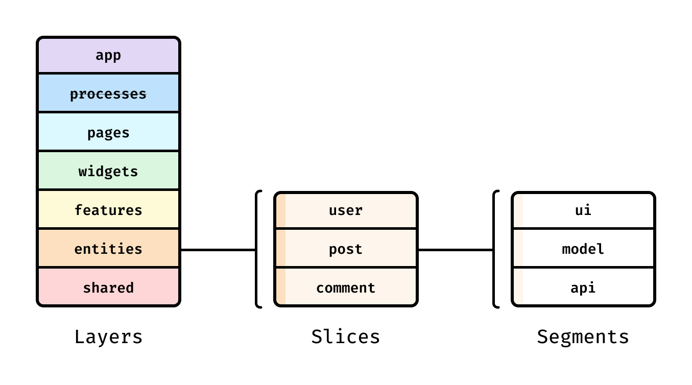

## Overview

Feature-Sliced Design (FSD) is an architectural methodology for scaffolding front-end applications. Simply put, it's a compilation of rules and conventions on organizing code.

## Is it right for me?

FSD can be implemented in projects and teams of any size. It is right for your project if:

- You're doing frontend (UI on web, mobile, desktop, etc.)
- You're building an application, not a library

And that's it! There are no restrictions on what programming language, UI framework, or state manager you use. You can also adopt FSD incrementally, use it in monorepos, and scale to great lengths by breaking your app into packages and implementing FSD individually within them.

## Concepts

Layers, slices, and segments form a hierarchy like this:

### Layers

Layers are standardized across all FSD projects. You don't have to use all of the layers, but their names are important. There are currently seven of them (from top to bottom):

1. **App** — everything that makes the app run — routing, entrypoints, global styles, providers.
2. **Processes** (deprecated) — complex inter-page scenarios.
3. **Pages** — full pages or large parts of a page in nested routing.
4. **Widgets** — large self-contained chunks of functionality or UI, usually delivering an entire use case.
5. **Features** — _reused_ implementations of entire product features, i.e. actions that bring business value to the user.
6. **Entities** — business entities that the project works with, like `user` or `product`.
7. **Shared** — reusable functionality, especially when it's detached from the specifics of the project/business, though not necessarily.

<Callout title="WARNING" type="warn">

Layers **App** and **Shared**, unlike other layers, do not have slices and are divided into segments directly.

However, all other layers — **Entities**, **Features**, **Widgets**, and **Pages**, retain the structure in which you must first create slices, inside which you create the segments.

</Callout>

The trick with layers is that modules on one layer can only know about and import from modules from the layers strictly below.

### Slices

Next up are slices, which partition the code by business domain. You're free to choose any names for them, and create as many as you wish. Slices make your codebase easier to navigate by keeping logically related modules close together.

Slices cannot use other slices on the same layer, and that helps with high cohesion and low coupling.

### Segments

Slices, as well as layers App and Shared, consist of segments, and segments group your code by its purpose. Segment names are not constrained by the standard, but there are several conventional names for the most common purposes:

- `ui` — everything related to UI display: UI components, date formatters, styles, etc.
- `api` — backend interactions: request functions, data types, mappers, etc.
- `model` — the data model: schemas, interfaces, stores, and business logic.
- `lib` — library code that other modules on this slice need.
- `config` — configuration files and feature flags.

Usually these segments are enough for most layers, you would only create your own segments in Shared or App, but this is not a rule.

## Advantages

- **Uniformity**
  Since the structure is standardized, projects become more uniform, which makes onboarding new members easier for the team.

- **Stability in face of changes and refactoring**
  A module on one layer cannot use other modules on the same layer, or the layers above.
  This allows you to make isolated modifications without unforeseen consequences to the rest of the app.

- **Controlled reuse of logic**
  Depending on the layer, you can make code very reusable or very local.
  This keeps a balance between following the **DRY** principle and practicality.

- **Orientation to business and users needs**
  The app is split into business domains and usage of the business language is encouraged in naming, so that you can do useful product work without fully understanding all other unrelated parts of the project.
