We are using [Beautiful Mermaid](https://agents.craft.do/mermaid) for diagrams in **Markdown**

## Examples

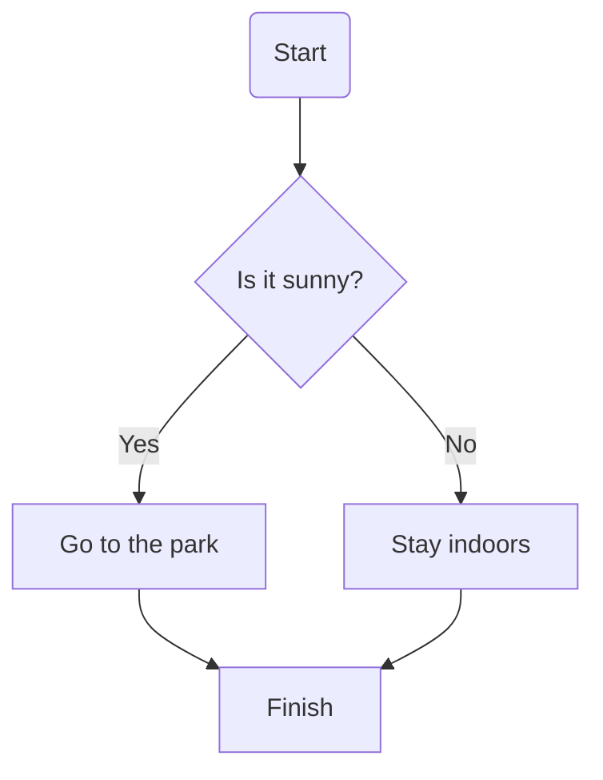

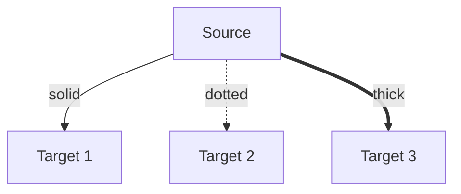

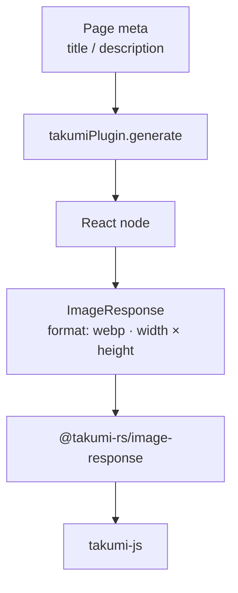

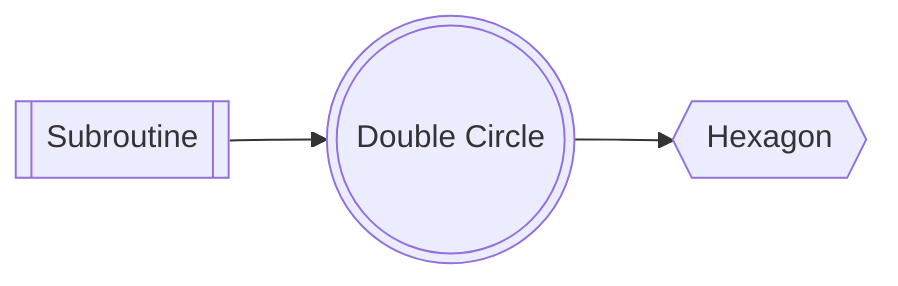

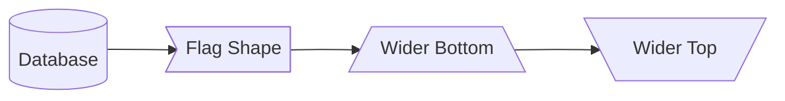

### Subgraphs

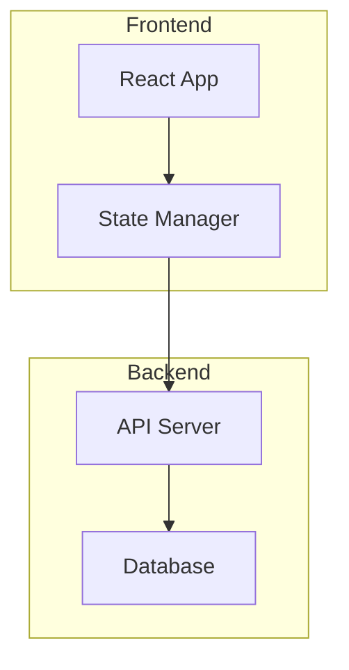

### Nested Subgraphs

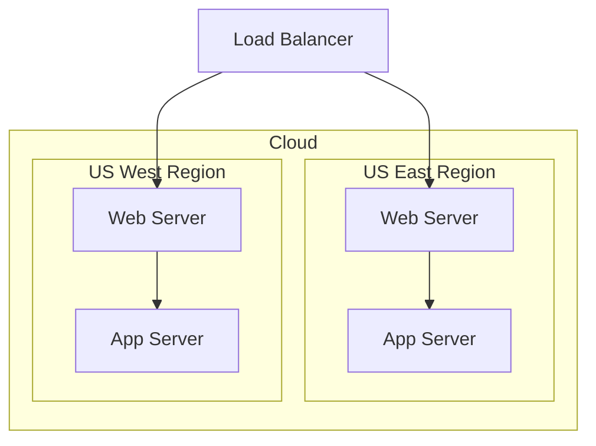

### Subgraph Direction Override

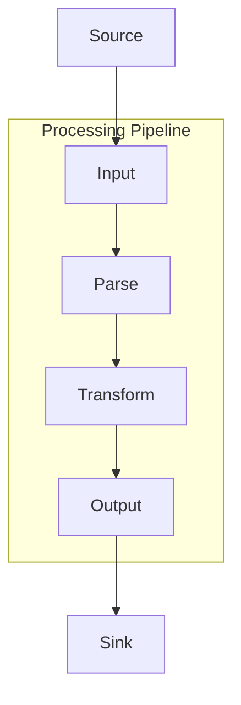

### Class Shorthand

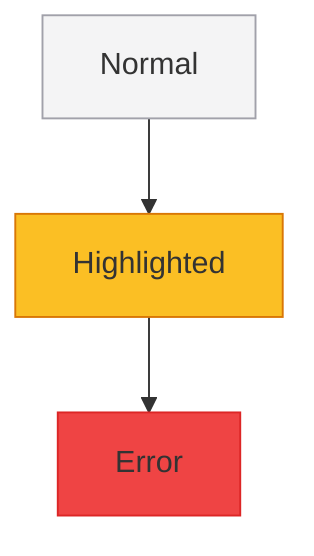

### System Architecture

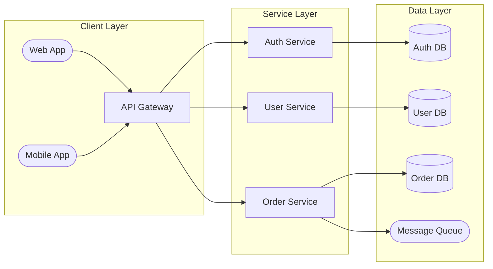

### State: Composite States

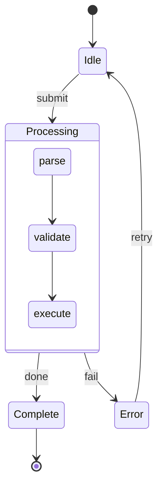

### Sequence: OAuth 2.0 Flow

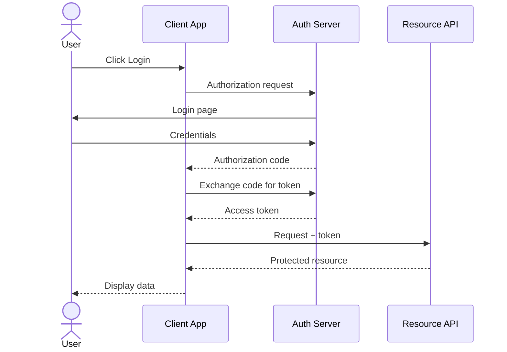

### ER: E-Commerce Schema

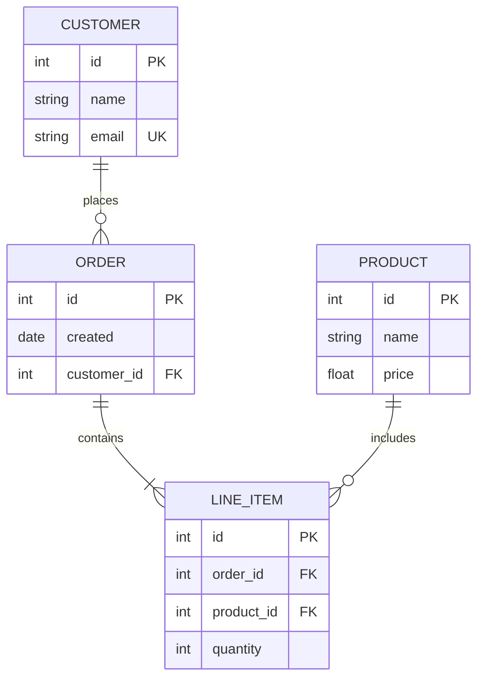

### XY: Simple Bar Chart

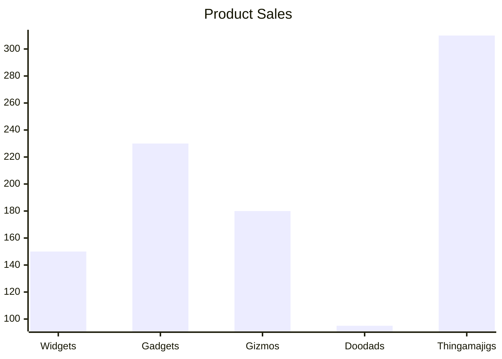
