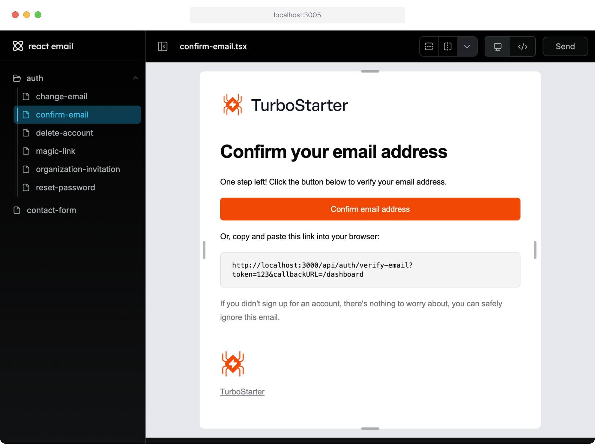

The `@workspace/email` package provides a simple and flexible way to send emails using various email providers. It abstracts the complexity of different email services and offers a consistent interface for sending emails with pre-defined templates.

To configure the email service, you need to set a few environment variables.

```dotenv
EMAIL_FROM="hello@resend.dev"
EMAIL_THEME="orange"
```

Let's break them down:

- `EMAIL_FROM` - The email address that emails will be sent from. **Please make sure that the mail address and domain are verified in your mail provider.**
- `EMAIL_THEME` - The theme color to use for the emails. See [Themes](/docs/web/customization/styling#themes) for more information.

The email provider is configured by modifying the exports in `packages/email` package. By default, [Nodemailer](/docs/web/emails/configuration#nodemailer) is used.

Configuration will be validated against the schema, so you will see the error messages in the console if something is not right.

## Providers

Astra supports multiple email providers, each with its own configuration. Below, you'll find detailed information on how to set up and use each supported provider. Choose the one that best fits your needs and follow the instructions in the respective accordion section.

<Accordions>
  <Accordion title="Resend" id="resend">
    To use Resend as your email provider, you need to [create an account](https://resend.com/) and [obtain your API key](https://resend.com/docs/dashboard/api-keys/introduction).

    Then, set it as an environment variable in your `.env.local` file in `apps/web` directory and your deployment environment:

    ```dotenv
    RESEND_API_KEY="your-api-key"
    ```

    Also, make sure to activate Resend as your email provider by updating the exports in:

    <Tabs items={["index.ts", "env.ts"]}>
      <Tab value="index.ts">
        ```ts
        // [!code word:resend]
        export * from "./resend";
        ```
      </Tab>

      <Tab value="env.ts">
        ```ts
        // [!code word:resend]
        export * from "./resend/env";
        ```
      </Tab>
    </Tabs>

    To customize the provider, you can find its definition in `packages/email/src/providers/resend` directory.

    For more information, please refer to the [Resend documentation](https://resend.com/docs).

  </Accordion>

  <Accordion title="SendGrid" id="sendgrid">
    To use SendGrid as your email provider, you need to [create an account](https://sendgrid.com/) and [obtain your API key](https://sendgrid.com/docs/ui/account-and-settings/api-keys/).

    Then, set it as an environment variable in your `.env.local` file in `apps/web` directory and your deployment environment:

    ```dotenv
    SENDGRID_API_KEY="your-api-key"
    ```

    Also, make sure to activate SendGrid as your email provider by updating the exports in:

    <Tabs items={["index.ts", "env.ts"]}>
      <Tab value="index.ts">
        ```ts
        // [!code word:sendgrid]
        export * from "./sendgrid";
        ```
      </Tab>

      <Tab value="env.ts">
        ```ts
        // [!code word:sendgrid]
        export * from "./sendgrid/env";
        ```
      </Tab>
    </Tabs>

    To customize the provider, you can find its definition in `packages/email/src/providers/sendgrid` directory.

    For more information, please refer to the [SendGrid documentation](https://sendgrid.com/docs).

  </Accordion>

  <Accordion title="Postmark" id="postmark">
    To use Postmark as your email provider, you need to [create an account](https://postmarkapp.com/) and [obtain your server API token](https://postmarkapp.com/support/article/1008-what-are-the-account-and-server-api-tokens).

    Then, set it as an environment variable in your `.env.local` file in `apps/web` directory and your deployment environment:

    ```dotenv
    POSTMARK_API_KEY="your-secret-api-token"
    ```

    Also, make sure to activate Postmark as your email provider by updating the exports in:

    <Tabs items={["index.ts", "env.ts"]}>
      <Tab value="index.ts">
        ```ts
        export * from "./postmark";
        ```
      </Tab>

      <Tab value="env.ts">
        ```ts
        // [!code word:postmark]
        export * from "./postmark/env";
        ```
      </Tab>
    </Tabs>

    To customize the provider, you can find its definition in `packages/email/src/providers/postmark` directory.

    For more information, please refer to the [Postmark documentation](https://postmarkapp.com/developer).

  </Accordion>

  <Accordion title="Plunk" id="plunk">
    To use Plunk as your email provider, you need to [create an account](https://plunk.dev/) and [obtain your API key](https://docs.useplunk.com/api-reference/authentication).

    Then, set it as an environment variable in your `.env.local` file in `apps/web` directory and your deployment environment:

    ```dotenv
    PLUNK_API_KEY="your-api-key"
    ```

    Also, make sure to activate Plunk as your email provider by updating the exports in:

    <Tabs items={["index.ts", "env.ts"]}>
      <Tab value="index.ts">
        ```ts
        // [!code word:plunk]
        export * from "./plunk";
        ```
      </Tab>

      <Tab value="env.ts">
        ```ts
        // [!code word:plunk]
        export * from "./plunk/env";
        ```
      </Tab>
    </Tabs>

    To customize the provider, you can find its definition in `packages/email/src/providers/plunk` directory.

    For more information, please refer to the [Plunk documentation](https://docs.useplunk.com).

  </Accordion>

  <Accordion title="nodemailer" id="nodemailer">
    If you're using the `nodemailer` as your email provider, you'll need to set the following SMTP configuration in your environment variables:

    ```dotenv
    NODEMAILER_HOST="your-smtp-host"
    NODEMAILER_PORT="your-smtp-port"
    NODEMAILER_USER="your-smtp-user"
    NODEMAILER_PASSWORD="your-smtp-password"
    ```

    The variables are:

    * `NODEMAILER_HOST`: The host of your SMTP server.
    * `NODEMAILER_PORT`: The port of your SMTP server.
    * `NODEMAILER_USER`: The email address user of your SMTP server.
    * `NODEMAILER_PASSWORD`: The password for the email account.

    Also, make sure to activate nodemailer as your email provider by updating the exports in:

    <Tabs items={["index.ts", "env.ts"]}>
      <Tab value="index.ts">
        ```ts
        // [!code word:nodemailer]
        export * from "./nodemailer";
        ```
      </Tab>

      <Tab value="env.ts">
        ```ts
        // [!code word:nodemailer]
        export * from "./nodemailer/env";
        ```
      </Tab>
    </Tabs>

    To customize the provider, you can find its definition in `packages/email/src/providers/nodemailer` directory.

    For more information, please refer to the [nodemailer documentation](https://nodemailer.com/smtp/).

  </Accordion>
</Accordions>

## Templates

In the `@workspace/email` package, we provide a set of pre-defined templates for you to use. You can find them in the `packages/email/src/templates` directory.

When you run your development server, you will be able to preview all available templates in the browser under [http://localhost:3005](http://localhost:3005).



Next to the templates, you can also find some shared components that you can use in your emails. The file structure looks like this:

<Files>
  <Folder name="templates" defaultOpen>
    <Folder name="_components - Shared components used in emails" />

    <Folder name="auth - Authentication related emails" />

    <File name="index.ts - Main entrypoint for the templates" />

  </Folder>
</Files>

Feel free to add your own templates and components or modify existing ones to match them with your brand and style.

### How to add a new template?

We'll go through the process of adding a new template, as it requires a few steps to make sure everything works correctly.

<Steps>
  <Step>
    #### Define types

    Let's assume that we want to add a **welcome email**, that new users will receive after signing up.

    We'll start with defining new template type in `packages/email/src/types/templates.ts` file:

    ```ts title="templates.ts"
    export const EmailTemplate = {
      ...AuthEmailTemplate,
      WELCOME: "welcome",
    } as const;
    ```

    Also, we would need to add types for variables that we'll pass to the template (if any), in our case it will be just a `name` of the user:

    ```ts title="templates.ts"
    type WelcomeEmailVariables = {
      welcome: {
        name: string;
      };
    };

    export type EmailVariables = AuthEmailVariables | WelcomeEmailVariables;
    ```

    By doing this, we ensure that payload passed to the template will have all required properties and we won't end up with an email that tells your user "Hey, undefined!".

  </Step>

  <Step>
    #### Create template

    Next up, we need to create a file with the template itself. We'll create an `welcome.tsx` file in `packages/email/src/templates` directory.

    ```tsx title="welcome.tsx"
    import { Heading, Preview, Text } from "react-email";

    import { Button } from "../_components/button";
    import { Layout } from "../_components/layout/layout";

    import type { EmailTemplate, EmailVariables } from "../../types";

    type Props = EmailVariables[typeof EmailTemplate.WELCOME];

    export const Welcome = ({ name }: Props) => {
      return (
        <Layout>
          <Preview>Welcome to Astra!</Preview>
          <Heading>Hi, {name}!</Heading>

          <Text>Start your journey with our app by clicking the button below.</Text>

          <Button>Start</Button>
        </Layout>
      );
    };

    Welcome.subject = "Welcome to Astra!";

    Welcome.PreviewProps = {
      name: "John Doe",
    };

    export default Welcome;
    ```

    As you can see, by defining appropriate types for the template, we can safely use the variables as a props in the template.

    To learn more about supported components, please refer to the [React Email documentation](https://react.email/docs/components).

  </Step>

  <Step>
    #### Register template

    We have to register the template in the main entrypoint of the templates in `packages/email/src/templates/index.ts` file:

    ```ts title="index.ts"
    import { Welcome } from "./welcome";

    export const templates = {
      ...
      [EmailTemplate.WELCOME]: Welcome,
    } as const;
    ```

    That way, it will be available in the `sendEmail` function, enabling us to send it from the server-side of your application.

    ```ts
    import { sendEmail } from "@workspace/email/server";

    sendEmail({
      to: "user@example.com",
      template: EmailTemplate.WELCOME,
      variables: {
        name: "John Doe",
      },
    });
    ```

    Learn more about sending emails in the [dedicated section](/docs/web/emails/sending).

  </Step>
</Steps>

Et voilà! You've just added a new email template to your application 🎉

### Translating templates

You can also translate your templates to support multiple languages. Each mail template is passed the `locale` property, which you can use to get the translation for the current locale. This allows you to maintain consistent translations across your application and emails.

The translation system [uses the same i18n setup](/docs/web/internationalization/overview) as your main application, so you can reuse your existing translation files and namespaces. The translations are loaded server-side when the email is generated, ensuring the correct language is used based on the user's preferences.

Here's how you can implement translations in your email templates:

```tsx
import { Heading, Preview, Text } from "react-email";

import { getTranslation } from "@workspace/i18n/server";

import { Button } from "../_components/button";
import { Layout } from "../_components/layout/layout";

import type { EmailTemplate, EmailVariables, CommonEmailProps } from "../../types";

type Props = EmailVariables[typeof EmailTemplate.WELCOME] & CommonEmailProps;

export const Welcome = async ({ name, locale }: Props) => {
  const { t } = await getTranslation({ locale, ns: "auth" });

  return (
    <Layout locale={locale}>
      <Preview>{t("account.welcome.preview")}</Preview>
      <Heading>{t("account.welcome.heading", { name })}</Heading>

      <Text>{t("account.welcome.body")}</Text>

      <Button>{t("account.welcome.cta")}</Button>
    </Layout>
  );
};

Welcome.subject = async ({ locale }: CommonEmailProps) => {
  const { t } = await getTranslation({ locale, ns: "auth" });
  return t("account.welcome.subject");
};

Welcome.PreviewProps = {
  name: "John Doe",
  locale: "en",
};

export default Welcome;
```

To send the email in the specified language, you can pass the optional `locale` argument to the `sendEmail` function:

```ts
sendEmail({
  to: "user@example.com",
  template: EmailTemplate.WELCOME,
  variables: {
    name: "John Doe",
  },
  locale: "en", // [!code highlight]
});
```

Learn more about translations in the [dedicated section](/docs/web/internationalization/translations).
