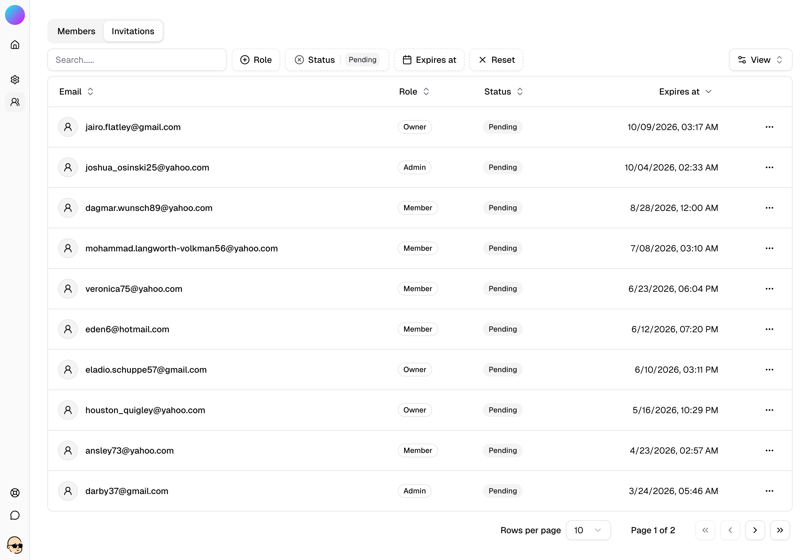
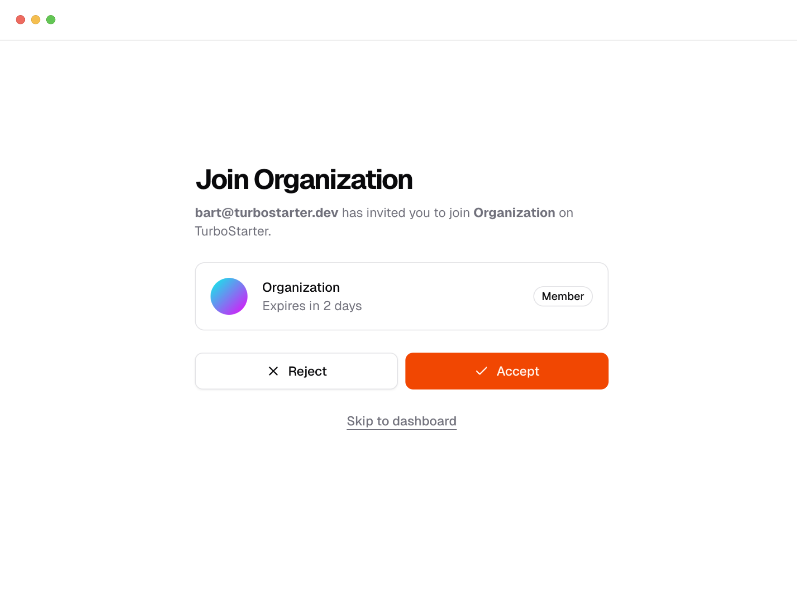
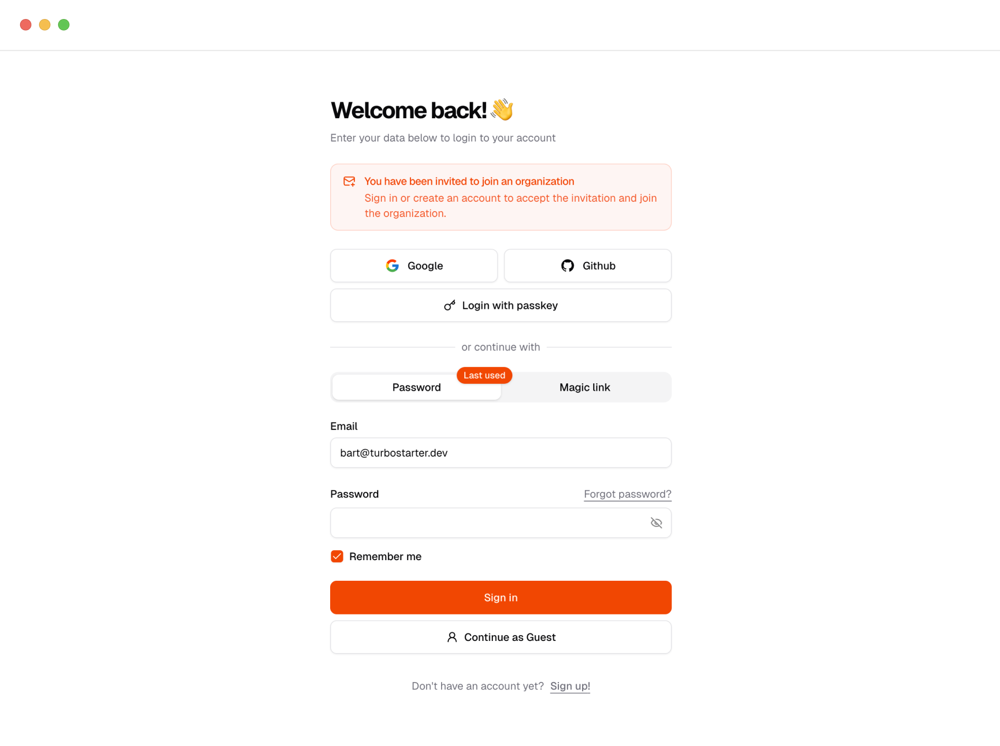

You can invite teammates **by email** to join an organization straight from your organization settings.

Acceptance is frictionless: we verify the invite, create (or reuse) the membership with the intended role, and activate the organization in the user's session.

The implementation is based on the [Better Auth plugin](https://www.better-auth.com/docs/plugins/organization) and designed to drive engagement, minimize back-and-forth and keep admins in control.



## Model

As we can see inside our [data model](/docs/web/organizations/data-model), an invitation targets an `email`, carries the intended `role`, records the `inviterId`, and is scoped to an `organizationId`.

```ts
export const invitation = pgTable("invitation", {
  id: text().primaryKey(),
  organizationId: text()
    .notNull()
    .references(() => organization.id, { onDelete: "cascade" }),
  email: text().notNull(),
  role: text(),
  status: text().default("pending").notNull(),
  inviterId: text()
    .notNull()
    .references(() => user.id, { onDelete: "cascade" }),
  createdAt: timestamp().defaultNow().notNull(),
  expiresAt: timestamp().notNull(),
});
```

The invitations expire at `expiresAt` to keep links short‑lived.

## Status

An invitation can be in one of three states:

- **Pending**: created/sent, awaiting acceptance.
- **Accepted**: verified; membership created or reused.
- **Rejected**: manually invalidated or removed via cascades.

<Callout>
  Expiration is controlled by `expiresAt` (not a separate status). After this timestamp, the link is
  invalid and should be resent.
</Callout>

## Flow

1. Admin creates an invite with `email` and `role`. The `organizationId` is inferred from the context.
2. System generates a signed, single-use token bound to the invite and `expiresAt` and sends a CTA link.
3. Recipient opens the link; we verify the token and email.
4. On success, we proceed to acceptance.

## Onboarding

### Existing user

After verification, we create (or reuse) a membership with the invited role and set the active organization in the session.


### New user

We attach the invite context to signup; after registration, we create the membership and activate the organization - no detours required.


You can fully customize the invitation flow to fit your organization's needs. For example, you can add extra onboarding steps, capture additional user information, or implement advanced verification logic as part of the invite process.

The system is designed to be extensible—tailor it to match your team's requirements and user experience preferences.

## Automatic invalidation

An invitation is automatically revoked in the following scenarios:

- **The user accepts the invitation:** Once accepted, the token becomes invalid.
- **The user changes their email address:** To prevent misuse, any changes to the associated email automatically invalidate the token.
- **The user deletes their account:** Invitations linked to a deleted account are revoked to maintain data integrity.

This ensures that invitations remain secure and aligned with the current state of user accounts.

## Invitation management

Admins of the organization and [super admins](/docs/web/admin/overview) can manage invitations via a dedicated section in the dashboard, where they can:

- View the status of all invitations (`pending`, `accepted`, `rejected`).
- Resend invitations who did not respond.
- Revoke invitations if they were sent to the wrong email or are no longer needed.
- Adjust the role of an invitation if not yet accepted
