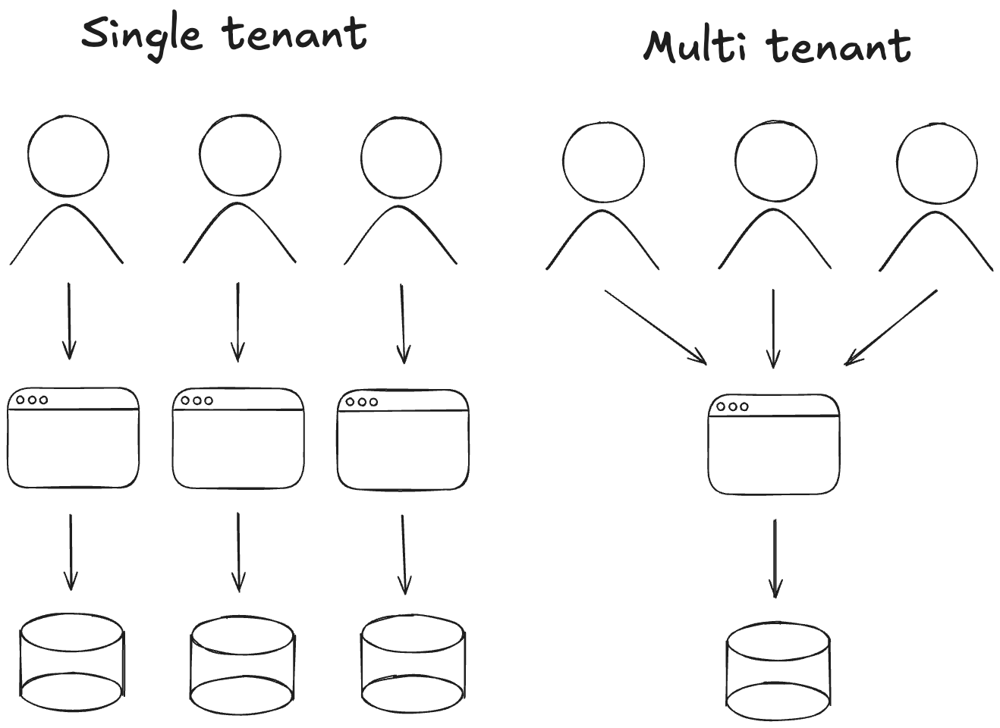

Organizations let you build teams and multi-tenant SaaS out of the box, which is a widely used pattern, especially in a [B2B](https://en.wikipedia.org/wiki/Business-to-business) apps. Users can create organizations, invite teammates, assign roles, and seamlessly switch between workspaces.

<Callout title="What is multi-tenancy?">
  [Multi-tenancy](https://www.ibm.com/think/topics/multi-tenant) is a software architecture pattern
  where a single instance of an application serves multiple tenants, each with its own data and
  configuration.
</Callout>

The feature is mostly powered by the [Better Auth organization plugin](https://www.better-auth.com/docs/plugins/organization) and integrates with Astra's API, routing, data layer, and UI components. This allows you to share most of the code between the web app, [mobile app](/docs/mobile/organizations/overview), and [extension](/docs/extension/organizations).

## Architecture

Astra uses a pragmatic multi-tenant architecture:

- **Tenant context** lives in the session as the active organization ID (derived from the user's selection or defaults). Server handlers read this context to enforce scoping.
- **Data scoping** is performed via `organizationId` on tenant-owned tables and guard clauses in queries. Background tasks and API routes receive the same context.
- **Authorization** combines tenant scoping with role checks. We separate “can access this tenant?” from “can perform this action within the tenant?”.
- **Extensibility**: add new tenant-bound entities by including `organizationId` and using the provided helpers to read the active organization.

This keeps data isolated per organization while remaining simple to reason about and customize.

<Callout>
  You can restrict who can create organizations, perform actions within it, and hook into
  lifecycle events using our API.

Check dedicated [Data model](/docs/web/organizations/data-model), [RBAC](/docs/web/organizations/rbac) and [Invitations](/docs/web/organizations/invitations) sections or direct [Better Auth docs](https://www.better-auth.com/docs/plugins/organization) for more details.

</Callout>

## Concepts

To effectively use multi-tenancy in your app, we introduced a few core concepts that define how the whole system works:

| Concept                 | Description                                                                                     |
| ----------------------- | ----------------------------------------------------------------------------------------------- |
| **Organization**        | A workspace that owns resources and settings, acting as an isolated tenant.                     |
| **Member**              | A user assigned to an organization.                                                             |
| **Role**                | Access level within an organization (see [RBAC](/docs/web/organizations/rbac)).                 |
| **Invitation**          | Email request to join an organization (see [Invitations](/docs/web/organizations/invitations)). |
| **Active organization** | The currently selected organization in a user's session, used to scope data and permissions.    |

These concepts provide the building blocks for flexible team management and secure, multi-tenant SaaS applications.

## Development data

In development, Astra automatically [seeds](/docs/web/installation/commands#seeding-database) some example data when you [setup services](/docs/web/installation/commands#setting-up-services):

- One organization is created by default.
- All default roles are created and assigned within that organization.
- Sample invitations are generated so you can test the invite flow.

You can safely experiment with these sample organizations, roles, and invitations to understand multi-tenancy features - [reset](/docs/web/installation/commands#resetting-database) or [reseed](/docs/web/installation/commands#seeding-database) anytime to return to the default state.

The default credentials for demo users can be customized using the `BETTER_AUTH_ADMIN_EMAIL` and `BETTER_AUTH_ADMIN_PASSWORD` environment variables.

<Callout type="error" title="Never run in production">
  The default development data and setup are intended for local development and testing only.
  **Never** use these seeds or configurations in a production environment - they are insecure and
  may expose sensitive functionality.
</Callout>

## Customization

You have flexibility to adapt organizations to fit your product. For example, you might rename labels (such as Organization to _Team_ or _Workspace_), and update the UI copy accordingly.

You can adjust the available [roles and permissions](/docs/web/organizations/rbac) to suit your access model.

The [invitation flow](/docs/web/organizations/invitations) can be customized, including how verification, onboarding, or metadata capture work.

You may also want to introduce tenant-specific policies, like usage limits, feature flags, or billing rules.

Feel free to check how to configure all of these features in the dedicated sections below.
