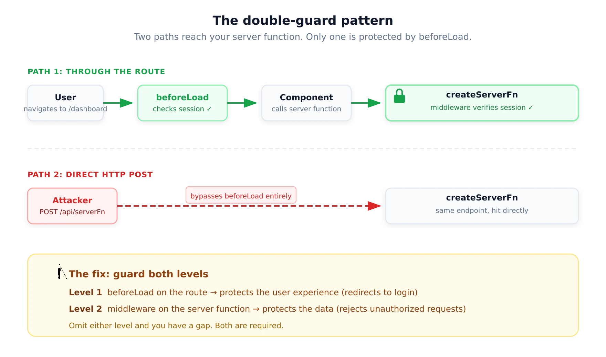

## The double-guard pattern



The architecture described above leads to a pattern that is specific to TanStack Start and worth naming explicitly: every protected operation needs guards at two levels.

**Level 1: Route guard via** `beforeLoad`. This protects the user experience. Unauthenticated users are redirected to login before seeing protected pages or triggering loaders.

**Level 2: Server function guard via middleware.** This protects the data and operations. Every server function that reads or writes sensitive data verifies the session itself, because it can be called directly as an HTTP endpoint.

```tsx
// Level 1: Route guard
export const Route = createFileRoute("/_protected")({
  beforeLoad: async () => {
    const user = await getUser();
    if (!user) {
      throw redirect({ to: "/login" });
    }
    return { user };
  },
  component: () => <Outlet />,
});

// Level 2: Server function guard
export const updateProfile = createServerFn({ method: "POST" })
  .middleware([authMiddleware]) // Enforced independently of the route
  .inputValidator(z.object({ name: z.string().min(1) }))
  .handler(async ({ data, context }) => {
    await db.users.update(context.user.id, { name: data.name });
    return { success: true };
  });
```

Omitting either level creates a gap. Without the route guard, unauthenticated users see protected UI before the server function rejects their request (bad UX). Without the server function guard, the data is accessible to anyone who calls the endpoint directly (security vulnerability).

## Reference

- [TanStack Start authentication: A developer's guide for 2026](https://workos.com/blog/tanstack-start-authentication-guide)
