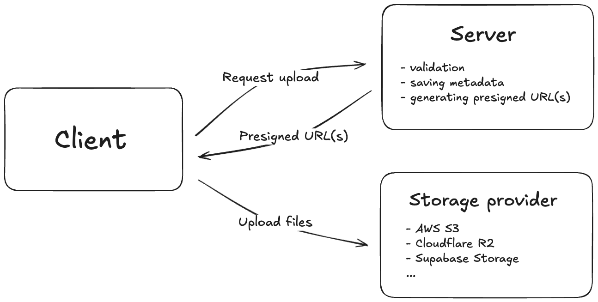

With Astra, you can easily upload and manage files (images, videos, documents, and more) in your application.

Currently, all S3-compatible storage providers are supported, including [AWS S3](https://aws.amazon.com/s3/), [DigitalOcean Spaces](https://www.digitalocean.com/products/spaces), [Cloudflare R2](https://www.cloudflare.com/products/r2/), [Supabase Storage](https://supabase.com/storage), and others.

If you're using Supabase, you can follow the [Supabase recipe](/docs/web/recipes/supabase#use-supabase-storage-as-s3-compatible-storage) for a concrete example of configuring Supabase Storage as your S3-compatible backend.

## Uploading files

The most common approach to uploading files is to use client-side uploads. With client-side uploads, you avoid paying ingress/egress fees for transferring file binary data through your server.

Additionally, most hosting platforms like [Vercel](https://vercel.com/docs/functions/runtimes#size-limits) or [Netlify](https://answers.netlify.com/t/what-is-the-maximum-file-size-upload-limit-in-a-netlify-form-submission/108419) have limitations on file size and maximum serverless function execution time.

That's why Astra utilizes the **presigned URLs** feature of storage providers to upload files. Instead of sending files to the serverless function, the client requests a time-limited presigned URL from the serverless function and then uploads the file directly to the storage provider.

1. Client **requests** a presigned URL from the serverless function.
2. Server parses the request, validates the payload, optionally saves the metadata, and **returns the presigned URL** to the client.
3. Client **uploads the file** to the presigned URL within the expiration time.
4. (Optional) Once the file is uploaded, the serverless function is notified about the upload event, and the file metadata is saved to the database.

<Callout>
  This approach ensures that credentials remain secure, handles authorization and authentication
  properly, and avoids the limitations of serverless platforms.
</Callout>

The configuration and use of storage is straightforward and simple. We'll explore this in more detail in the following sections.
