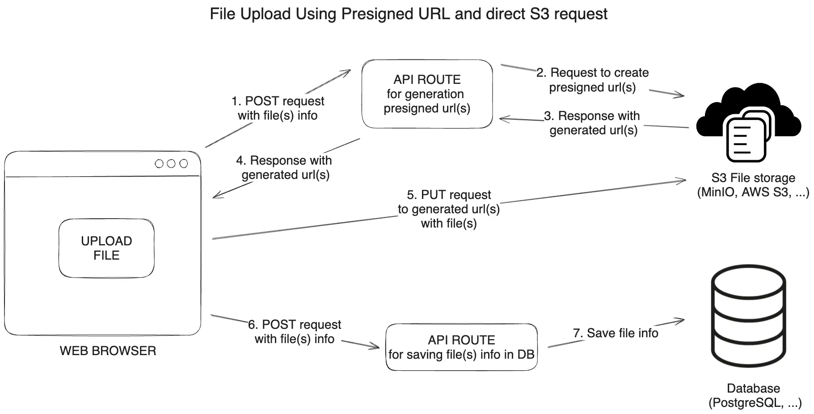
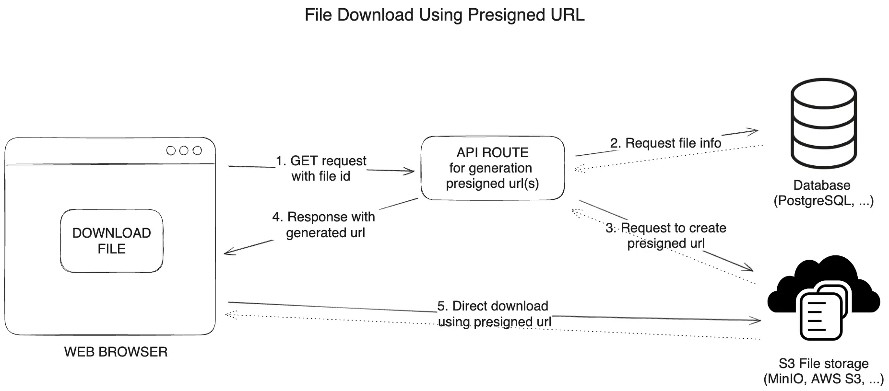
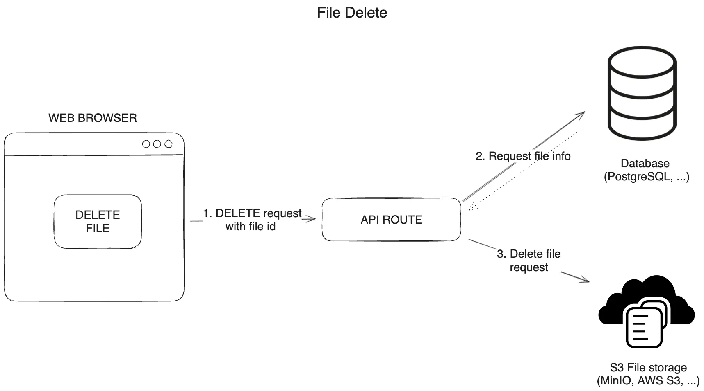

## Schema design

```ts
model File {
    id           String   @id @default(uuid())
    //  the name of the bucket in S3 where the file is stored, in our case it will be the same for all files.
    bucket       String
    // the name of the file in S3, it will be unique for each file. If users upload files with the same name, the new file will overwrite the old one.
    fileName     String   @unique
    // the original name of the file that the user uploaded. We will use it to display the file name to the user when downloading the file.
    originalName String
    createdAt    DateTime @default(now())
    // the size of the file in bytes.
    size         Int
}
```

## Upload files using presigned URLs



In the diagram above, we can see the steps involved in uploading and downloading files using presigned URLs.
It is a more complex approach, but it does not use resources on the Next.js server with file uploads.
The presigned URL is generated on the server and sent to the client. The client uses the presigned URL to upload the file directly to S3.

To upload files:

1. The user sends a POST request to the API route with the file info to upload.
2. The API route sends requests to S3 to generate presigned URLs for each file.
3. The S3 returns the presigned URLs to the API route.
4. The API route sends the presigned URLs to the client.
5. The client uploads the files directly to S3 using the presigned URLs and PUT requests.
6. The client sends the file info to the API route to save the file info.
7. The API route saves the file info to the database.

## Download files using presigned URLs



To download files:

1. The user sends a GET request with file id to the API route to get file.
2. The API route sends a request to the database to get the file name and receives the file name.
3. The API route sends a request to S3 to generate a presigned URL for the file and receives the presigned URL.
4. The API route sends the presigned URL to the client.
5. The client downloads the file directly from S3 using the presigned URL.

## Delete files from S3



The algorithm for deleting files from S3:

1. Remove the file from the list of files on the client immediately.
1. Send a DELETE request to the API route to delete the file from the S3 bucket and the database.
1. Fetch the files after deleting.

## Reference

- [How to upload to S3 in Next.js and save references in Postgres](https://neon.com/guides/next-upload-aws-s3)
- [Upload a file to S3 with Next.js 13.4 and app router](https://medium.com/@antoinewg/upload-a-file-to-s3-with-next-js-13-4-and-app-router-e04930601cd6)
- [Building a file storage with Next.js, PostgreSQL, and Minio S3](https://www.alexefimenko.com/posts/file-storage-nextjs-postgres-s3)
