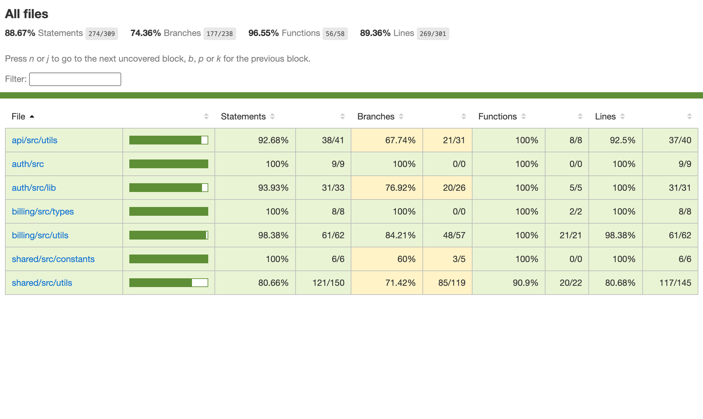

Unit tests are a type of automated test where individual units or components are tested. The "unit" in "unit test" refers to the smallest testable parts of an application. These tests are designed to verify that each unit of code performs as expected.

Astra uses [Vitest](https://vitest.dev) as the unit testing framework. It's a blazing-fast test runner built on top of [Vite](https://vitejs.dev), designed for modern JavaScript and TypeScript projects.

<Callout title="Why Vitest?">
  If you've used [Jest](https://jestjs.io) before, you already know Vitest - it shares the same API. But Vitest is built for speed: native TypeScript support without transpilation, parallel test execution, and a smart watch mode that only re-runs tests affected by your changes.

It comes with everything you need out of the box - code coverage, snapshot testing, mocking, and a slick UI for debugging. Fast feedback, zero configuration.

</Callout>

## Why write unit tests?

Unit tests give you **fast, focused feedback** on small pieces of your code - individual functions, hooks, or components. Instead of debugging an entire page or flow, you can verify just the logic you care about in isolation.

They also act as **living documentation**: a good test tells you how a function is supposed to behave, which edge cases are important, and what assumptions the code makes. This makes it much easier to safely refactor or extend features later.

In Astra, unit tests are designed to be **cheap and quick to run**, so you can keep Vitest running in watch mode while you code. Every change you make is immediately checked, helping you catch regressions before they ever reach integration or end‑to‑end tests.

## Configuration

Astra configures Vitest to be **as simple as possible**, while still taking advantage of [Turborepo's caching](https://turborepo.com/docs/crafting-your-repository/caching) and Vitest's [Test Projects](https://vitest.dev/guide/projects).

```ts title="vitest.config.ts"
import { mergeConfig } from "vitest/config";

import baseConfig from "@workspace/vitest-config/base";

export default mergeConfig(baseConfig, {
  test: {
    /* your extended test configuration here */
  },
});
```

- **Per-package tests**: each package that has unit tests defines its own `test` script. This keeps the configuration close to the code and makes it easy to add tests to any workspace.
- **Turbo tasks for CI**: the root `test` task (`pnpm test`) uses `turbo run test` to execute all package-level test scripts with smart caching, which is ideal for CI pipelines where you want to avoid re-running unchanged tests.
- **Vitest Test Projects for local dev**: a root Vitest configuration uses [Test Projects](https://vitest.dev/guide/projects) to run all unit test suites from a single command, which is perfect for local development when you want fast feedback across the whole monorepo.

This **hybrid setup** combines Turborepo and Vitest Projects in a way that fits Astra's principles: cached, package-aware runs in CI, and a single, unified Vitest entry point for local development.

You can read more about this setup in the official documentation guides listed below.

<Cards>
  <Card title="Vitest" description="turborepo.com" href="https://turborepo.com/docs/guides/tools/vitest" />

  <Card title="Test Projects" description="vitest.dev" href="https://vitest.dev/guide/projects" />
</Cards>

## Running tests

There are a few different ways to run unit tests, depending on what you're doing:

- **CI / full test run** - at the root of the repo:

```bash
pnpm test
```

This runs `turbo run test`, which executes all `test` scripts in packages that define them, with Turborepo handling caching so unchanged packages are skipped. This is what you should use in your CI/CD pipeline.

- **One-off local run with Vitest Projects**:

```bash
pnpm test:projects
```

This uses Vitest [Test Projects](https://vitest.dev/guide/projects) to run all configured unit test suites from a single command, which is great when you want to quickly validate the whole monorepo locally.

- **Watch mode during development**:

```bash
pnpm test:projects:watch
```

This starts Vitest in watch mode across all Test Projects. As you edit files, only the affected tests are re-run, giving you fast feedback while you work.

## Code coverage

Unit test coverage helps you understand **how much** of your code is being tested. While it can't guarantee bug-free code, it shines a light on untested paths that could hide issues or regressions.

To generate a code coverage report for all unit tests, run:

```bash
pnpm turbo test:coverage
```

This command runs the coverage task across all relevant packages (using Turborepo) and collects the results into a single coverage output.

To open the coverage report in your browser:

```bash
pnpm turbo test:coverage:view
```

This will build the HTML report and launch it using your default browser, so you can explore which files and branches are covered.

<Callout title="Uploading coverage as an artifact">
  You can also store the generated coverage report as a [GitHub Actions artifact](https://docs.github.com/en/actions/using-workflows/storing-workflow-data-as-artifacts) during your CI/CD pipeline, just add the following steps to your workflow job:

```yaml title=".github/workflows/ci.yml"
# your workflow job configuration here

- name: 📊 Generate coverage
  run: pnpm turbo test:coverage

- name: 🗃️ Archive coverage report
  uses: actions/upload-artifact@v5
  with:
    name: coverage-${{ github.sha }}
    path: tooling/vitest/coverage/report
```

This will generate a test coverage report and upload it as an artifact, so you can access it from GitHub Actions tab for later inspection.

</Callout>

A high coverage percentage means your tests execute most lines and branches - but the quality and relevance of your tests matter more than the raw number. Use coverage reports to spot gaps and guide improvements, not as the sole metric of test health.



## Best practices

Unit tests should work **for you**, not the other way around. Focus on writing tests that make it easier to change code with confidence, not on satisfying arbitrary rules or reaching a magic number in a dashboard.

Code coverage is a **useful metric**, but it **SHOULD NOT** be the goal. It's better to have a smaller set of high‑value tests that cover critical paths and edge cases than a huge suite of fragile tests that are hard to maintain.

When in doubt, ask: _“Does this test give **me** confidence that I can change this code without breaking users?”_ If the answer is no, refactor or remove it.

Finally, keep unit tests focused on **small, isolated pieces of logic**. More advanced flows — like multi-step user journeys, cross-service interactions, or full-page behavior — are better covered by [end-to-end (E2E) tests](/docs/web/tests/e2e), where you can verify the system as a whole.
